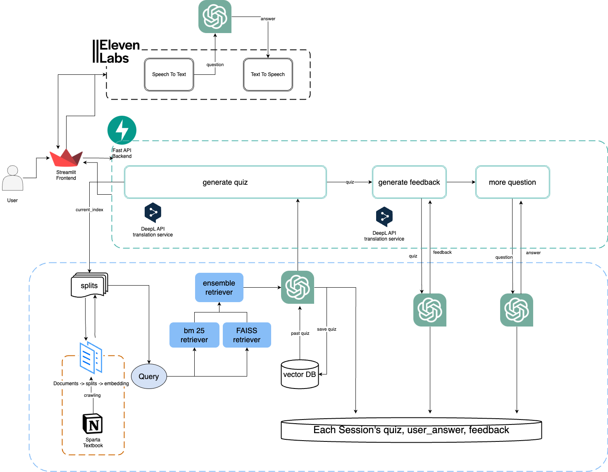
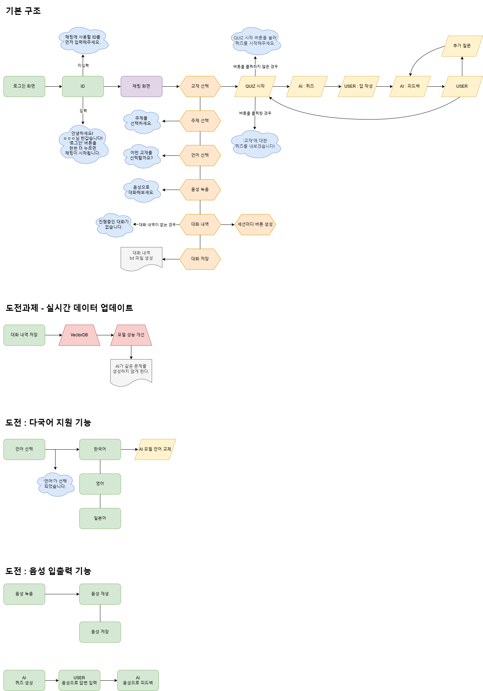

# 🤖 RAG를 활용한 Sparta 복습용 챗봇 만들기

## 📖 목차
1. [How To Use](#-how-to-use)
2. [Directory Structure](#-directory-structure)
3. [팀 소개 및 협업 도구](#-팀-소개-및-협업-도구)
4. [프로젝트 소개](#-프로젝트-소개)
5. [프로젝트 계기](#-프로젝트-계기)
6. [프로젝트 핵심 목표](#-프로젝트-핵심-목표)
7. [Key Summary](#️-key-summary)
8. [인프라 아키텍처 & 적용 기술](#-인프라-아키텍처-적용-기술)
9. [주요기능](#-주요기능)
10. [서비스 구조](#-서비스-구조)
11. [기술적 고도화](#-기술적-고도화)
12. [Timeline](#-timeline)

---
## 📣 How To Use
```
1. 원격 저장소에 올라와 있는 코드 clone 받기
git clone https://github.com/KooSuYeon/palddakpalddak.git

2. 라이브러리 사용을 위한 Conda 환경 생성
- for Linux/macOS
(사전에 Anaconda가 설치되어 있어야 합니다.)
(conda 24.5.0)
conda env create -f palddak.yaml

- for Windows
(사전에 Anaconda가 설치되어 있어야 합니다.)
(conda 24.5.0)
conda env create -f palddak_win.yaml

3. 환경 활성화
conda activate palddak

4. 사전에 공유된 구글 드라이브 링크에서 dataset 디렉터리를 다운로드 받아준 후 루트 디렉터리에 해당 디렉터리를 위치시켜 줍니다.

5. .env 설정
OPENAI_API_KEY, DEEPL_API_KEY, ELEVENLABS_API_KEY 환경 설정을 해줍니다.

6. 실행 
streamlit run v2_Client_UI.py  
  
```

---

## 🔍 Directory Structure

- 동작을 위해 필요한 파일 : palddak_backend.py, palddak_frontend.py, rag_model.py, audio_model.py, dataset 디렉터리, palddak.yaml
- be, fe, rag_model : 백엔드, 프론트엔드, rag모델 버전 관리 (이전 버전)
- rag_model_output, user_chatlog_client, user_chatlog_server : 사용자 채팅 관리

```
palddakpalddak/
├── be/ # 과거 백엔드 버전
│   ├── get_history_app.py
│   ├── get_specific_input.py
│   └── v0_be.py
├── dataset/ # 교재가 들어있는 디렉터리 (반드시 존재해야합니다!!!)
├── fe/ # 과거 프론트엔드 버전
│   ├── v1_fe.py
│   └── v2_fe.py
├── pre_processing/ # 데이터셋 전처리 디렉터리
│   ├── pre_processing.py # 실제 교재 전처리 코드
│   └── pre_processing_opensource # 실제 open_source 전처리 코드
├── rag_model/ # 과거 rag_model 버전
│   ├── naive_rag_model.py
│   ├── v0_rag_chatbot.ipynb
│   ├── v1_rag_chatbot.ipynb
│   ├── v2_rag_chatbot.ipynb
│   ├── v3_rag_chatbot.ipynb
│   ├── v4_rag_chatbot.ipynb
│   └── v5_rag_chatbot.ipynb
├── rag_model_output/ # RAG 모델 구동 output 세션 별로 저장 파일 명의 형태, DB 처럼 관리 목적
    {user_id}_{session_no}_{type_}_{order}_quiz.txt
    {user_id}_{session_no}_{type_}_{order}_user.txt
    {user_id}_{session_no}_{type_}_{order}_feedback.txt
├── user_chatlog_client/ # client 단 저장하는 채팅로그
├── user_chatlog_server/ # server 단 저장하는 채팅로그
├── .gitignore
├── audio_model.py # 음성 출력 모델
├── rag_model.py # 학습용 챗봇 모델
├── Readme.md
├── requirements.txt
├── palddak_backend.py # 실제 BE
└── palddak_frontend.py # 실제 FE
└── palddak.yaml # 환경 활성화 파일

```


---
## 🦾 팀 소개 및 협업 도구
- 팀명 : 팔딱팔딱

| 이름   | 역할                            |
|--------|---------------------------------|
| 구수연 | 팀장, AI 모델 개발, 데이터 수집, 대화세션 관리, 모델 성능개선 |
| 박성진 | 데이터 전처리, API, 데이터 수집, SA 문서, 서버 개발 |
| 윤수진 | Streamlit UI, 데이터 수집, 대화세션 관리 |
| 이현승 | Streamlit UI, 데이터 수집       |
| 김윤소 | AI 모델 개발, API, 데이터 수집  |

- 협업도구
   - GitHub
   - Jira
   - Slack
   - Notion
   - Figma
- 버전관리: Git (배포 X)


---
## 📋 프로젝트 소개
- 프로젝트명 : Sparta Review Helper
- 개발 기간 : 2024.11.21 - 2024.12.03

---
## 💡 프로젝트 계기
이번 스파르타 과정에서 저희가 배웠던 여러가지 내용들을 복습하는데 활용하는 AI 챗봇을 개발하면 유용할 것 같다는 생각에, 배운 자료들과 추가 오픈소스 등을 바탕으로 AI가 퀴즈를 내고 사용자가 정답을 입력하면 이에 대해 피드백해주는 학습용 AI 모델을 개발하게 되었습니다.

---
## ❕ 프로젝트 핵심 목표
저희 프로젝트의 목적은 부트캠프에서 배운 내용을 복습할 수 있는 퀴즈 챗봇을 구현하는 것입니다.
이 챗봇은 저희가 강의에서 배웠던 내용들을  학습하여, 내용을 퀴즈 형태로 제공하고, 유저의 답변에 대한 피드백을 제공하여 복습을 도와주고, 사용자의 흥미를 높일 수 있도록 설계되었습니다.

---
## 🗝️ Key Summary
- 학습용 RAG 기반 질문, 피드백 생성 챗봇
   - RAG(Retrieval-Augmented Generation) 모델을 기반으로 사용자가 원하는 교재에 맞춤화된 질문을 생성한 후 사용자의 학습을 이끌어낸 챗봇입니다.
   - 질문에 대한 답을 하면 추가적인 피드백, 추가 질문을 가능하게 해 추가 학습도 돕습니다.
   - 기존에 특정 질문에만 연관된 결과가 반환되던 문제를 해결해 정확하고 연관성 높은 답변을 제공합니다.
- 주요 트러블 슈팅 사례
   <details>
  <summary>동적 크롤링에서 토글 형식으로 숨겨진 웹페이지 content를 갖고 오지 못하는 이슈</summary>

   원인 : </br>주요 콘텐츠가 담기기까지 기다리고 토글 형식의 요소는 명시적으로 누르는 코드를 추가했어야 했습니다.

   해결 코드 :
   ```
   driver.get(url)  # 페이지 로드

         # 페이지 로드 대기
      try:
         WebDriverWait(driver, 10).until(
               EC.presence_of_element_located((By.CSS_SELECTOR, '.notion-page-content'))
         )
         print("페이지가 완전히 로드되었습니다.")
      except Exception as e:
         print(f"페이지 로딩 실패: {url}. Error: {e}")
         continue
   ```
   ```
   # 토글이 닫혀 있으면 토글을 열기
      try:
         # 모든 토글 버튼을 찾음 (Ctrl+Alt+T에 해당하는 토글을 찾아서 열기)
         toggle_buttons = driver.find_elements(By.XPATH, "//div[@role='button' and (@aria-expanded='false')]")

         # 각 토글을 클릭하여 열기
         for button in toggle_buttons:
               button.click()
               time.sleep(1)  # 토글이 열리기 전에 잠깐 대기
   ```

  </details>

   <details>
  <summary>데이터 전처리 과정에서 주요 텍스트가 삭제되는 경우</summary>

   원인 : </br>교재에서 코드 부분이 있었기 때문에 특수 기호는 삭제하지 말았어야 했던 부분이었습니다.

   해결 코드 :
   ```
   # 전처리 함수 정의
   def preprocess_text(txt):
      # 1. '[스파르타코딩클럽]' 제거
      txt = re.sub(r'\[?스파르타코딩클럽\]?', '', txt)

      # 2. 저작권 문구 제거
      txt = re.sub(r'Copyright.*$', '', txt)

      # 3. \xa0를 공백으로 변환
      txt = txt.replace('\xa0', ' ')

      # 4. 정규식을 사용해 \\로 시작하는 LaTeX 명령어 제거
      txt = re.sub(r'\\[a-zA-Z]+\{.*?\}', '', txt)  

      # 5. \command{...} 형식 제거
      txt = re.sub(r'\\[a-zA-Z]+', '', txt)  

      return txt
   ```

  </details>

  <details>
  <summary>챗봇이 유사한 질문을 계속 반복하는 이슈</summary>

   원인 : </br>유사도 기반 retriever에서 계속해서 같은 문맥만을 갖고 왔기 때문이었습니다.

   해결 코드 :
   ```
   def get_retriever(texts: str, current_index:int, api_key=str):

      # text_list를 Document 객체로 변환
      documents = [Document(page_content=texts)]

      recursive_text_splitter = RecursiveCharacterTextSplitter(
         chunk_size=200,
         chunk_overlap=20,
         length_function=len,
         is_separator_regex=False,
      )

      splits_recur = recursive_text_splitter.split_documents(documents)
      total_chunks = len(splits_recur)

      current_index %= total_chunks
      # 다음 인덱스 계산
      next_index = current_index + 10
      if next_index >= total_chunks:  # 초과 시 순환 처리
         selected_splits = splits_recur[current_index:] + splits_recur[:next_index % total_chunks]
      else:
         selected_splits = splits_recur[current_index:next_index]

      splits = selected_splits


      # print("Top 10 chunks:")
      # for i, chunk in enumerate(splits[:10], 1):
      #     pprint(f"\nChunk {i}:\n{chunk.page_content}")

      # OpenAI 임베딩 모델 초기화
      embeddings = OpenAIEmbeddings(model="text-embedding-ada-002", api_key=api_key)
      vectorstore = FAISS.from_documents(documents=splits, embedding=embeddings)
      bm25_retriever = BM25Retriever.from_documents(splits)
      faiss_retriever = vectorstore.as_retriever()

      retriever = EnsembleRetriever(
                  retrievers=[bm25_retriever, faiss_retriever],
                  weights=[0.5, 0.5],  # 가중치 설정 (가중치의 합은 1.0)
               )

      return retriever 
   ```

  </details>

---
## 🏠 인프라 아키텍처 & 적용 기술



- 아키텍처 구조
   - Frontend: Streamlit을 사용하여 직관적이고 간단한 사용자 인터페이스(UI)를 제공합니다.
   - Backend: FastAPI와 Python 기반으로 데이터 처리 및 API 호출을 담당합니다.
   - Retriever: FAISS + mb25 retriever (ensemble retriever) 를 활용해 문서 검색 및 질의응답에 최적화된 데이터베이스를 구축합니다.
- 적용 기술 및 이유
   - LangChain: RAG 모델과의 유기적 통합을 통해 효율적인 질문-응답 생성을 구현합니다.
   - Selenium + BeautifulSoup: 웹 데이터를 수집 및 전처리하고, 강의 자료를 활용할 수 있습니다.
   - OpenAI API: GPT 기반 언어 모델을 통해 사용자 친화적인 답변을 제공합니다.
   - GitHub, Slack, Jira, Notion: 협업 및 버전 관리 도구로 프로젝트의 생산성과 관리 효율성을 극대화합니다.

---
## 💬 주요기능
1. 퀴즈 생성 및 피드백 제공
   - 사이드바의 주제 및 교재 선택 기능을 통해 원하는 내용을 지정하고 QUIZ 시작 버튼을 누르면, AI가 관련된 퀴즈를 자동으로 생성합니다.
   - 사용자가 채팅으로 답변을 입력하면, AI는 답변에 대한 피드백을 제공합니다.
   - 추가적인 질문에 대해서도 AI가 대화를 이어가며 지속적으로 피드백을 제공합니다.
   - QUIZ 시작 버튼을 누를 때마다 중복되지 않는 새로운 퀴즈가 생성됩니다.
2. 언어 선택 기능
   - 언어 선택 버튼을 통해 원하는 언어를 선택하면, AI가 해당 언어로 답변을 생성합니다.
3. 음성 입력 및 피드백
   - AI가 퀴즈를 생성한 후, 사용자가 음성으로 답변을 입력하면, AI는 음성으로 피드백을 제공합니다.

이러한 기능을 통해 학습자는 다양한 방식으로 학습 내용을 복습하며 더욱 효과적으로 학습할 수 있습니다.

---

## 🗂️ 서비스 구조

1. 전체 흐름
   - 사용자가 사이드바에서 주제를 선택하고 QUIZ 시작 버튼을 클릭합니다.
   - AI 백엔드에서 선택한 주제와 교재에 맞는 퀴즈를 생성해 클라이언트로 전달합니다.
   - 사용자가 답변을 입력하면, AI가 백엔드에서 입력된 답변을 분석하고 피드백을 생성해 반환합니다.
   - 음성 모드에서는 음성 입력을 받아 텍스트로 변환하고, 다시 음성 피드백을 제공합니다.
2. 구성 요소
   - 프론트엔드
      - UI : 사이드바(주제/교재 선택, 언어 선택, 음성 녹음, 대화 내역), 채팅(대화 내용, 사용자 입력) 인터페이스로 구성되었습니다.
      - 사용자와 인터페이스 간의 상호작용 : 사용자의 선택 및 입력을 백엔드로 전달합니다.
   - 백엔드
      - 퀴즈 생성 모듈 : 강의 자료를 기반으로 적절한 퀴즈를 자동으로 생성합니다.
      - 답변 분석 및 피드백 생성 모듈 : 사용자 입력 데이터를 기반으로 피드백을 생성합니다.
   - 데이터베이스
      - 교재 및 강의 자료 파일을 저장합니다.
      - 생성된 퀴즈 기록, 사용자의 입력, 그에 기반한 피드백 데이터를 관리합니다.
3. 동작 예시
   -  사용자가 '머신러닝' 주제와 그와 관련된 교재를 선택한 후 `QUIZ 시작 버튼`을 통해 퀴즈를 요청 → AI가 QUIZ 생성 → 사용자가 답변 → AI가 피드백을 제공.

---
## 🛫 추가적인 기술적 고도화
- 구수연
   <details>
   <summary>트러블 슈팅</summary>

      [성능 개선 / 코드 개선 요약]
      - 질문을 생성하는 챗봇이 유사한 질문을 계속해서 질문하는 경우
      [가설]
      - FAISS 기반 retriever가 항상 같은 질문만을 가져오는 경우
      [해결 방안]
      - cosine 유사도 비교로 유사한 질문을 생성해내는 경우에는 다른 질문을 생성하도록 했음
      - cosine 유사도는 단어의 유사도를 비교하는 것에 약점을 보였기 때문에 성능이 크게 좋아지지 않음 (실패)
      - 프롬프팅으로 고도화 시도 (성공)
      [해결 완료]
      - 프롬프트에 이전 질문을 넣어줌으로 llm에 명시적으로 과거의 질문과 겹치지 않도록 질문생성 유도하니 해결
      [회고]
      - 유사도의 메서드 사용 개념을 추가적으로도 검사하면 좋겠다고 생각해 후의 고도화에 TfidfVectorizer를 통한 벡터화를 진행 후 유사도 비교를 진행하였습니다.
      - 해당 유사도 비교로는 성능 개선을 보였고 특정 횟수 (10번)을 넘어간다면 질문을 생성하지 않는 출제 방식으로 수정하여 교재에 대해 질문의 range가 다 찼을 경우도 적용해 볼 수 있는 기회가 되었습니다.

   </div>
   </details>

- 윤수진
   <details>
   <summary>핵심 성능 개선</summary>

      [내가 구현한 기능]
      - 로그인과 채팅 페이지 분리 : 로그인 페이지와 채팅 페이지를 UI 단에서 분리하여 사용자가 로그인하면 채팅 페이지에 접근할 수 있습니다.
      - 세션 관리 : 사이드바의 버튼으로 대화 세션을 구분해 세션별로 대화 내역을 확인할 수 있습니다.
      [주요 로직]
      - 로그인 페이지와 채팅 페이지 분리
         st.session_state.page 값에 따라 login_page() 함수나 chat_page() 함수를 실행하여 로그인 페이지 또는 채팅 페이지를 보여줍니다.
      - 세션 관리
         - 대화 기록이 존재하는 지 여부를 확인하여, 대화 기록이 없으면 "진행중인 대화가 없습니다."라는 메시지를 표시합니다.
         - 대화 기록이 존재하는 경우, ChatID를 기준으로 대화 기록을 구분하며 각 대화 ID에 대해 사이드바에 버튼을 생성합니다.
            사용자가 버튼을 클릭하면 클릭된 버튼에 연결된 ChatID와 일치하는 대화 기록만 필터링하여 대화 내역을 로드합니다.
      [배경]
      - 한 대화에서 사용자의 입력만큼 버튼이 생성되어 사이드바의 내용이 불필요하게 길어졌습니다.
      - 챗봇의 추가적인 기능을 구현하기 위해, 로그인 페이지와 채팅 페이지를 분리할 필요가 있었습니다.
      [요구사항]
      - 로그인 시 채팅 페이지로 이동하고, 새로고침하면 로그인 페이지가 로드되도록 해야 합니다.
      - 하나의 대화 세션에 하나의 버튼만 생성되어야 합니다.

   </div>
   </details>

   <details>
   <summary>트러블 슈팅</summary>

      [성능 개선 / 코드 개선 요약]
      - get_button_label 함수에서 발생한 IndexError를 해결하기 위해서 예외 처리를 추가하여 코드의 안정성을 개선했습니다.
      - "User" 메시지가 없을 때 발생할 수 있는 오류를 방지하고, 메시지를 통해 사용자에게 피드백을 제공하게 했습니다.
      [문제 정의]
      - get_button_label 함수 수정 중 IndexError가 발생했습니다.
      [가설]
      - 데이터에서 "User" 메시지를 탐색할 때, 대소문자가 다르거나 메시지가 없는 경우가 원인일 수 있었습니다.
      [해결 방안]
      - 코드 수정
         "User" 대신 "user"로 대소문자를 수정하여 데이터 키와 일치하도록 변경했습니다.
         예외 처리를 추가하여 User 메시지가 없는 경우에도 안정적으로 작동하도록 구현했습니다.
      - 예외 처리
         User 메시지가 없을 경우 "No User message found"라는 기본 메시지를 반환하도록 설정했습니다.
      [해결 완료]
      - IndexError 발생 없이 버튼 레이블이 정상적으로 출력되었습니다.
      - User 메시지가 없을 경우에도 "No User message found" 메시지가 출력되었습니다.
      [회고]
      - 기술의 장단점 : 대소문자 불일치와 예외 상황을 모두 처리하여 코드 안정성을 향상시켰습니다. 그러나 대소문자만 수정했기 때문에 데이터가 달라지면 이 값도 수정해야 합니다.
      - 다시 시도한다면? : 처음부터 데이터 구조를 정확하게 파악하고, 이를 기반으로 코드를 설계할 것입니다. 코드 작성 시 예외 처리와 데이터 유효성 검사에 더 신경 써서, 예상치 못한 오류가 발생하지 않도록 철저하게 준비할 것입니다. 또한, 코드 작성 후에는 충분한 테스트를 통해 다양한 경우의 수를 체크하여 안정성을 높일 것입니다.

   </div>
   </details>

- 박성진
   <details>
   <summary>핵심 성능 개선</summary>

      [내가 구현한 기능]
      - 연속적인 대화 구현 : RAG 모델이 질문과 피드백을 생성한 이후 이어지는 대화에서 마지막 대화내용을 세션정보로 저장해 추가적인 답변이 이어지도록 구현하였습니다.
      - API 연동 및 서버구현 : Fast API 서버를 구축하고, API 메서드로 RAG 모델과 클라이언트 간의 요청을 실시간으로 처리하였습니다.
      - 대화 세션 구현 : 기존 대화내역으로 구성된 세션페이지를 실시간으로 채팅할 수 있는 세션으로 구성하고, 대화내역 보기 버튼을 채팅페이지에 추가했습니다.
      - 음성 대화기능(STT,TTS) : 사용자가 음성을 입력하면 이룰 텍스트로 변환해 채팅에 로드하고, 이에 대한 AI 답변을 실시간으로 음성 변환해 재생하였습니다.

      [주요 로직]
       - RAG 모델의 현재 답변상태를 나타내는 세션변수 quiz_status_check 로 AI의 답변 로직을 분리하여 관리합니다.
       - 각 UI 버튼에 on_change 함수와 콜백 함수를 선언하여 API 요청과 예외 처리를 안정적으로 관리합니다
       - st.session_state.chat_session 와 st.session_state.chat_log 를 분할하여 현재세션과 이전 대화세션을 관리합니다.
       - parse_txt_to_chat 함수를 활용해 txt 형태의 파일을 파싱하여 딕셔너리 형태로 전환해 해당 정보로 채팅 화면을 구성합니다.
       - Speech_To_Text 함수로 사용자의 음성을 클라이언트 폴더와 st.session_state.audio_text 에 저장하여 채팅을 입력합니다.
       - text_to_speech_file 함수로 AI의 입력을 elevenlabs API를 활용해 스트리밍 음성으로 변환 후, 해당 데이터를 각 청크로 나누어 음성 재생이 가능한 byte 형식으로 변환합니다.
  
      [요구사항]
       - 챗봇 대화기능 : 사용자와의 대화 내역을 저장하고 관리합니다.
       - API 기능 : 사용자가 입력한 데이터를 API를 통해 전송하고, 응답을 받아옵니다.
       - 대화 세션 관리 : 각 대화 세션을 구분하여 저장하고, 불러올 수 있습니다.
       - 사용자의 음성을 입력으로 받고, 이를 통해 AI의 답변을 음성으로 출력하는 기능을 구현합니다.
   </div>
   </details>

   <details>
   <summary>트러블 슈팅</summary>

      [성능 개선 / 코드 개선 요약]
      - UI 개선 : 주요 기능을 모듈화하고 QA과정에서 발생한 아래 이슈들을 수정하였습니다.
          1. 로그인 페이지에서 사이드박스 조작이 가능한 현상
          2. 새로운 채팅이 화면 상단에서 갱신되는 현상
          3. 특정 버튼을 클릭했을 때 페이지 갱신이 안되는 현상
      - 대화내역 보기 가시성 개선 : 기존 assisstant 와 user 로 이어진 대화내역을 텍스트아이콘과 대화 간 "\n\n" 연산자를 이중 삽입하여 가시성을 개선했습니다.
      - 서버 실행로직 개선 : server_check 엔드포인트로 서버상태를 확인 후 페이지가 로드되게 개선하였습니다.
      - 세션변수 관리 : 클라이언트 상에서 사용되는 세션변수를 각 기능에 맞게 관리하고 코드 안정성을 개선하였습니다.
      
      [문제 정의]
      
      [가설]
      
      [해결 방안]
         
      [해결 완료]
      
      [회고]
      

   </div>
   </details>
---
## 🎢 Timeline
<details>
  <summary>Timeline</summary>
  
  - [x] 11/21 챗봇 종류 정하기 및 데이터셋 범위 설정  
  - [x] 11/22 데이터셋 준비 & 전처리 완료  
  - [x] 11/27 대화 내용 저장 & RAG 1차 고도화 완료  
  - [x] 11/27 프론트엔드 채팅 화면 구현 완료  
  - [x] 11/27 백엔드 질문 전송, 답변 전송 구현 완료  
  - [x] 11/28 대화 내용을 구체적인 이름을 가진 txt 파일 저장으로 수정 완료 & RAG 2차 고도화 완료  
  - [x] 11/28 프론트엔드 옵션 선택 사이드 바 구현 완료 & 변경된 input값 적용 완료  
  - [x] 11/28 대화 저장 API 생성 완료 & 백엔드 수정된 input 값 적용 완료  
  - [x] 11/29 프론트엔드 user_id 로그인 화면 구현  
  - [x] 11/29 프론트엔드 세션 버튼 생성  
  - [x] 11/29 백엔드 세션 저장 API 연결  
  - [x] 11/29 RAG 모델에 이전 대화 내용 기억하는 기능 추가하여 3차 고도화 완료
  - [x] 12/01 retriever에 순회성을 부여하여 4차 고도화 완료
  - [x] 12/01 백엔드 최근 대화 API, Text To Speech 구현
  - [x] 12/02 프론트 엔드 녹음 기능 구현
  - [x] 12/02 번역 API연결하여 RAG 5차 고도화 완료, 백엔드에도 번역 API 연결
  - [x] 12/03 Speech To Text 구현 및 LLM 연결
</details>
