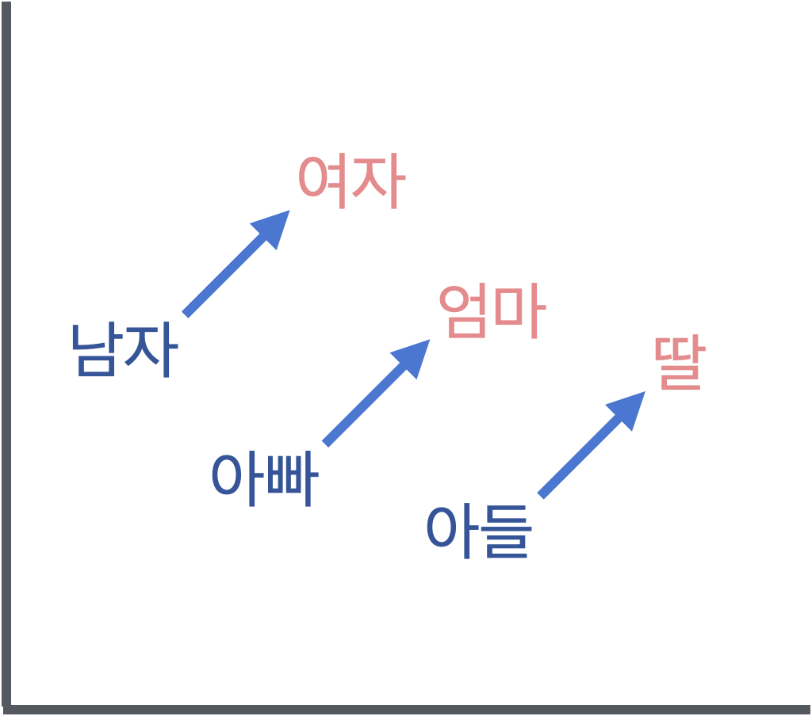
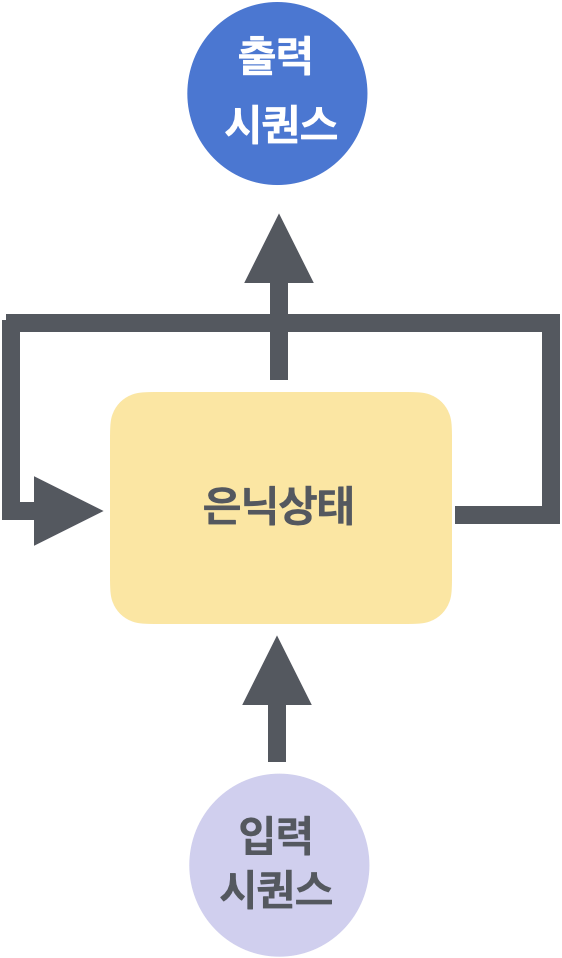
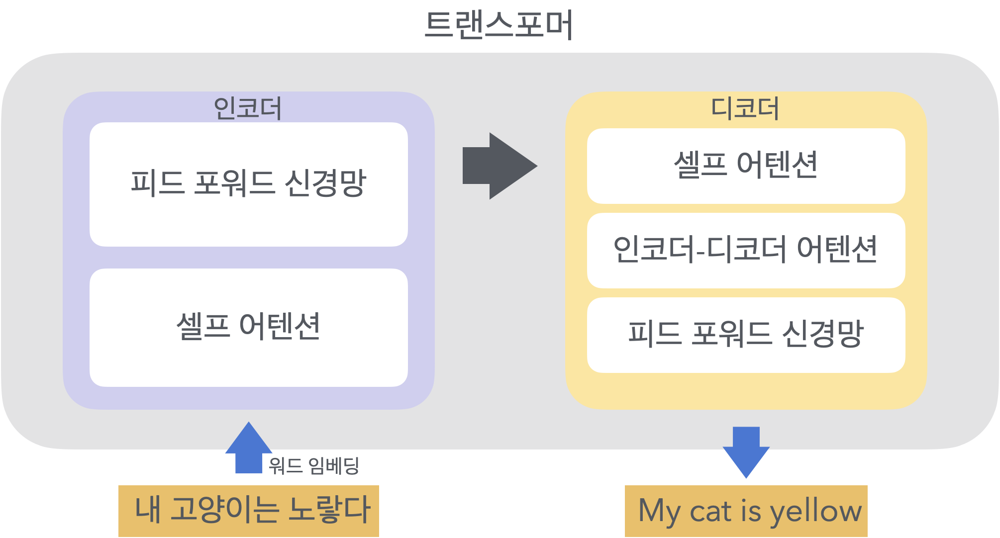

# Attention 메커니즘
- 시퀀스 데이터에서 중요한 부분에 더 많은 가중치를 할당하여 정보를 효율적으로 처리하는 기법
- 주로 자연어 처리(NLP)와 시계열 데이터에서 사용되며, 기계 번역, 요약, 질의응답 시스템 등 다양한 분야에서 뛰어난 성능을 발휘

1. **개요**
    - Attention 메커니즘은 입력 시퀀스의 각 요소에 대해 중요도를 계산하여 가중치를 부여
    - 이를 통해 중요한 정보에 집중하고, 불필요한 정보 무시
    - Attention 메커니즘의 구성 요소 : Query, Key, Value.
2. **Attention 스코어 계산**
    - Attention 스코어는 Query와 Key 간의 유사도를 측정하여 중요도 계산
    - 이 유사도는 내적(dot product) 등을 사용하여 계산 가능
    - $\text{score}(Q, K) = Q \cdot K^T$
3. **Softmax를 통한 가중치 계산**
    - 계산된 Attention 스코어는 Softmax 함수를 통해 확률 분포로 변환
    - 이를 통해 가중치의 합이 1이 되도록 설정
    - $\alpha_i = \frac{\exp(\text{score}(Q, K_i))}{\sum_{j} \exp(\text{score}(Q, K_j))}$
4. **Softmax를 통한 가중치 계산**
    - Softmax를 통해 얻어진 가중치를 Value에 곱하여 최종 Attention 출력을 계산

### **Self-Attention**

- 시퀀스 내의 각 요소가 서로를 참조하는 메커니즘. 입력 시퀀스의 모든 요소가 Query, Key, Value로 사용
- 이를 통해 각 요소가 시퀀스 내 다른 요소들과의 관계를 학습
- 문장 내에서 단어 간의 관계를 학습하여 **번역이나 요약에 활용** 가능

### **Multi-Head Attention**

- 여러 개의 Self-Attention을 병렬로 수행하는 메커니즘
- 각 헤드는 서로 다른 부분의 정보를 학습하며, 이를 통해 모델이 다양한 관점에서 데이터 처리


### Attention 구현
 - **Scaled Dot-Product Attention**
```python
import torch
import torch.nn.functional as F

def scaled_dot_product_attention(Q, K, V):
    d_k = Q.size(-1)  # Key의 차원 수
    scores = torch.matmul(Q, K.transpose(-2, -1)) / torch.sqrt(torch.tensor(d_k, dtype=torch.float32))  # 유사도 계산 및 스케일링
    attn_weights = F.softmax(scores, dim=-1)  # Softmax를 통한 가중치 계산
    output = torch.matmul(attn_weights, V)  # 가중합을 통한 최종 출력 계산
    return output, attn_weights
```

 - **Multi-Head Attention**

```python
class MultiHeadAttention(nn.Module):
    def __init__(self, embed_size, heads):
        super(MultiHeadAttention, self).__init__()
        self.embed_size = embed_size
        self.heads = heads
        self.head_dim = embed_size // heads

        assert (
            self.head_dim * heads == embed_size
        ), "Embedding size needs to be divisible by heads"

        self.values = nn.Linear(self.head_dim, self.head_dim, bias=False)
        self.keys = nn.Linear(self.head_dim, self.head_dim, bias=False)
        self.queries = nn.Linear(self.head_dim, self.head_dim, bias=False)
        self.fc_out = nn.Linear(heads * self.head_dim, embed_size)

    def forward(self, values, keys, query, mask=None):
        N = query.shape[0]
        value_len, key_len, query_len = values.shape[1], keys.shape[1], query.shape[1]

        # Linear transformations
        values = self.values(values).view(N, value_len, self.heads, self.head_dim)
        keys = self.keys(keys).view(N, key_len, self.heads, self.head_dim)
        queries = self.queries(query).view(N, query_len, self.heads, self.head_dim)

        # Scaled dot-product attention
        out, _ = scaled_dot_product_attention(queries, keys, values)

        out = out.view(N, query_len, self.heads * self.head_dim)
        out = self.fc_out(out)
        return out
```
---

# Attention 메커니즘
- 시퀀스 데이터에서 중요한 부분에 더 많은 가중치를 할당하여 정보를 효율적으로 처리하는 기법
- 주로 자연어 처리(NLP)와 시계열 데이터에서 사용되며, 기계 번역, 요약, 질의응답 시스템 등 다양한 분야에서 뛰어난 성능을 발휘

1. **개요**
    - Attention 메커니즘은 입력 시퀀스의 각 요소에 대해 중요도를 계산하여 가중치를 부여
    - 이를 통해 중요한 정보에 집중하고, 불필요한 정보 무시
    - Attention 메커니즘의 구성 요소 : Query, Key, Value.
2. **Attention 스코어 계산**
    - Attention 스코어는 Query와 Key 간의 유사도를 측정하여 중요도 계산
    - 이 유사도는 내적(dot product) 등을 사용하여 계산 가능
    - $\text{score}(Q, K) = Q \cdot K^T$
3. **Softmax를 통한 가중치 계산**
    - 계산된 Attention 스코어는 Softmax 함수를 통해 확률 분포로 변환
    - 이를 통해 가중치의 합이 1이 되도록 설정
    - $\alpha_i = \frac{\exp(\text{score}(Q, K_i))}{\sum_{j} \exp(\text{score}(Q, K_j))}$
4. **Softmax를 통한 가중치 계산**
    - Softmax를 통해 얻어진 가중치를 Value에 곱하여 최종 Attention 출력을 계산

### **Self-Attention**

- 시퀀스 내의 각 요소가 서로를 참조하는 메커니즘. 입력 시퀀스의 모든 요소가 Query, Key, Value로 사용
- 이를 통해 각 요소가 시퀀스 내 다른 요소들과의 관계를 학습
- 문장 내에서 단어 간의 관계를 학습하여 **번역이나 요약에 활용** 가능

### **Multi-Head Attention**

- 여러 개의 Self-Attention을 병렬로 수행하는 메커니즘
- 각 헤드는 서로 다른 부분의 정보를 학습하며, 이를 통해 모델이 다양한 관점에서 데이터 처리


### Attention 구현
 - **Scaled Dot-Product Attention**
```python
import torch
import torch.nn.functional as F

def scaled_dot_product_attention(Q, K, V):
    d_k = Q.size(-1)  # Key의 차원 수
    scores = torch.matmul(Q, K.transpose(-2, -1)) / torch.sqrt(torch.tensor(d_k, dtype=torch.float32))  # 유사도 계산 및 스케일링
    attn_weights = F.softmax(scores, dim=-1)  # Softmax를 통한 가중치 계산
    output = torch.matmul(attn_weights, V)  # 가중합을 통한 최종 출력 계산
    return output, attn_weights
```

 - **Multi-Head Attention**

```python
class MultiHeadAttention(nn.Module):
    def __init__(self, embed_size, heads):
        super(MultiHeadAttention, self).__init__()
        self.embed_size = embed_size
        self.heads = heads
        self.head_dim = embed_size // heads

        assert (
            self.head_dim * heads == embed_size
        ), "Embedding size needs to be divisible by heads"

        self.values = nn.Linear(self.head_dim, self.head_dim, bias=False)
        self.keys = nn.Linear(self.head_dim, self.head_dim, bias=False)
        self.queries = nn.Linear(self.head_dim, self.head_dim, bias=False)
        self.fc_out = nn.Linear(heads * self.head_dim, embed_size)

    def forward(self, values, keys, query, mask=None):
        N = query.shape[0]
        value_len, key_len, query_len = values.shape[1], keys.shape[1], query.shape[1]

        # Linear transformations
        values = self.values(values).view(N, value_len, self.heads, self.head_dim)
        keys = self.keys(keys).view(N, key_len, self.heads, self.head_dim)
        queries = self.queries(query).view(N, query_len, self.heads, self.head_dim)

        # Scaled dot-product attention
        out, _ = scaled_dot_product_attention(queries, keys, values)

        out = out.view(N, query_len, self.heads * self.head_dim)
        out = self.fc_out(out)
        return out
```

# 자연어 처리 모델 (NLP)

### 워드 임베딩(Word Embedding)
 - 단어를 고정된 크기의 벡터로 변환하는 기법으로, 단어 간의 의미적 유사성을 반영

1. **Word2Vec**
- 단어를 벡터로 변환하는 두 가지 모델(CBOW와 Skip-gram)을 제공
    - **CBOW (Continuous Bag of Words)**: 주변 단어(context)로 중심 단어(target)를 예측
    - **Skip-gram**: 중심 단어(target)로 주변 단어(context)를 예측

2. **GloVe (Global Vectors for Word Representation)**
- 단어-단어 공기행렬(word-word co-occurrence matrix)을 사용, 단어 벡터를 학습
- 전역적인 통계 정보를 활용하여 단어 간의 의미적 유사성 반영



### 시퀀스 모델링
 - 순차적인 데이터를 처리하고 예측하는 모델링 기법
 - 주로 RNN, LSTM, GRU와 같은 순환 신경망을 사용



&nbsp;

### Transformer와 BERT


