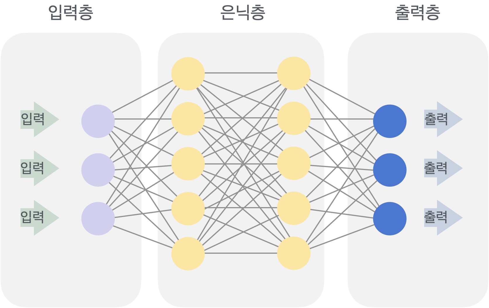
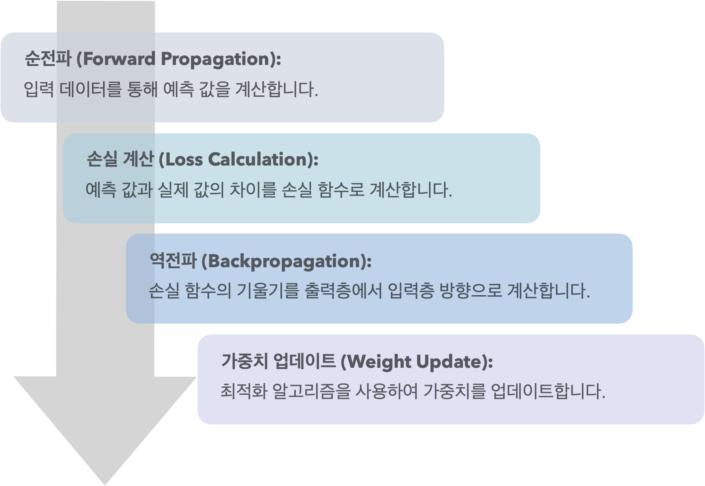
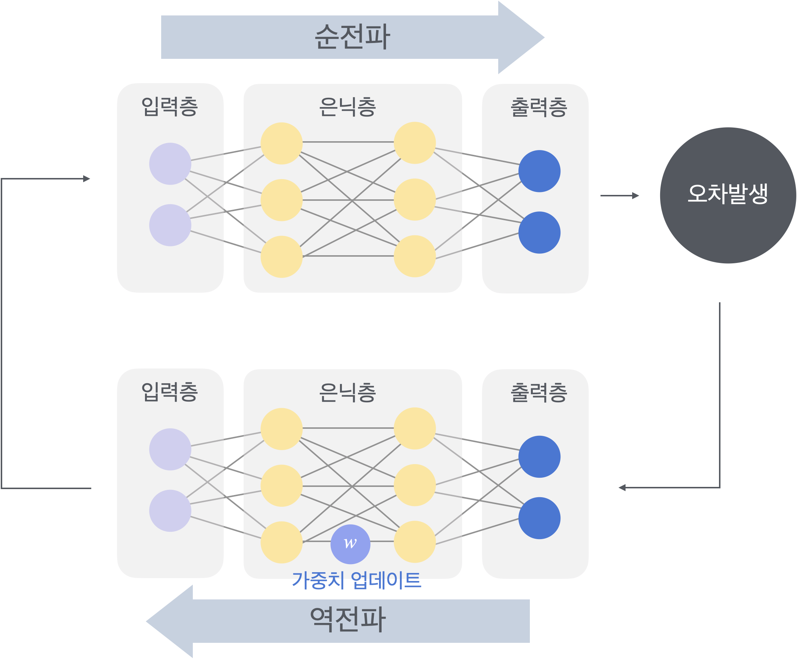
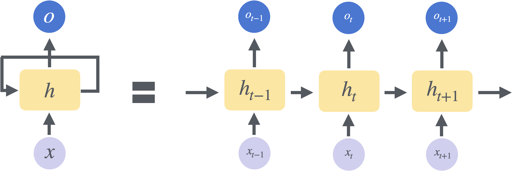
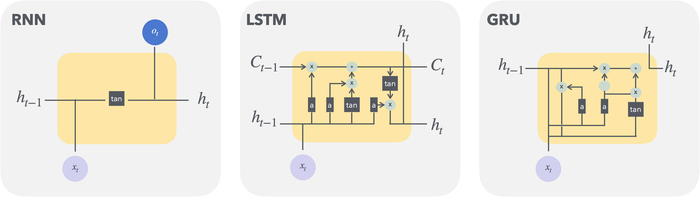

## 퍼셉트론
 - 인공 신경망의 가장 기본적인 단위로, 하나의 뉴런을 모델링한 것
 - 입력 값을 받아 가중치(weight)를 곱하고, 이를 모두 더한 후 활성화 함수(activation function)를 통해 출력 값을 결정

 

 $$ y = f(\sum_{i=1}^{n} w_i x_i + b) $$

 여기서 $x_i$는 입력 값, $w_i$는 가중치, $b$는 bias, $f$는 활성화 함수입니다.

## 다층 퍼셉트론 (MLP)
- 여러 층의 퍼셉트론을 쌓아 올린 신경망 구조
- 입력층(input layer), 은닉층(hidden layer), 출력층(output layer)으로 구성



- **입력 레이어(Input Layer) :** 외부 데이터가 신경망에 입력되는 부분. 입력 레이어의 뉴런 수는 입력 데이터의 특징 수와 동일
- **은닉 레이어(Hidden Layer) :** 입력 데이터 처리, 특징 추출 
- **출력 레이어(Output Layer) :** 최종 예측 값을 출력. 출력 레이어의 뉴런 수는 예측하려는 클래스 수 또는 회귀 문제의 출력 차원과 동일

## 활성화 함수 (Activation function)
 - 신경망의 각 뉴런에서 입력값을 출력값으로 변환
 - 단순 선형변환에서 벗어나 비 선형성을 도입하여 신경망이 복잡한 패턴을 학습하도록 유도
 &nbsp;
 1. **ReLU** **(Rectified Linear Unit)**
    
    $$
    f(x) = \max(0, x)
    $$
    
    - 장점: 계산이 간단하고, 기울기 소실 문제(vanishing gradient problem) 완화
    - 단점: 음수 입력에 대해 기울기가 0이 되는 '죽은 ReLU' 문제 발생 가능
&nbsp;
2. **Sigmoid**
    
    $$
    f(x) = \frac{1}{1 + e^{-x}} 
    $$
    
    - 장점: 출력 값이 0과 1 사이로 제한되어 확률을 표현하기에 적합
    - 단점: 기울기 소실 문제, 출력 값이 0 또는 1에 가까워질 때 학습이 느려지는 단점
&nbsp;
3. **Tanh (Hyperbolic Tangent)**
    
    $$
    f(x) = \tanh(x) = \frac{e^x - e^{-x}}{e^x + e^{-x}}
    $$
    
    - 장점: 출력 값이 -1과 1 사이로 제한
    - 단점: 기울기 소실 문제 발생 가능

    ---
# 손실 함수와 알고리즘
### 손실 함수 (loss funciton)
- 모델의 예측 값과 실제 값 사이의 차이를 측정하는 함수
- 모델의 성능을 평가하고, 최적화 알고리즘을 통해 모델을 학습시키는데 사용  
&nbsp;
1. **MSE (Mean Squared Error)** - 회귀 문제에서 주로 사용

$$
\text{MSE} = \frac{1}{n} \sum_{i=1}^{n} (y_i - \hat{y}_i)^2 
$$


2. **Cross-Entropy** - 분류 문제에서 주로 사용 (예측 확률과 실제 클래스 간의 차이를 측정)

$$
\text{Cross-Entropy} = -\sum_{i=1}^{n} y_i \log(\hat{y}_i)
$$

### 최적화 알고리즘 (Optimization Algorithm)
- 손실 함수를 최소화하기 위해 모델의 가중치를 조정
- 손실 함수의 기울기를 계산하고, 이를 바탕으로 가중치를 업데이트

### 역전파 알고리즘 (Backpropagation)
- 신경망의 가중치를 학습시키기 위해 사용되는 알고리즘
- 출력에서 입력 방향으로 손실 함수의 기울기를 계산하고, 이를 바탕으로 가중치를 업데이트

**역전파의 수학적 원리**
- 연쇄 법칙(Chain Rule)을 사용해 손실함수의 기울기 계산
- 각 층의 기울기는 이전 층의 기울기와 현재 층의 기울기를 곱하여 계산
- 이를 통해 신경망의 모든 가중치 업데이트



---
# 인공 신경망 (ANN)
 - 생물학적 신경망을 모방하여 설계된 컴퓨팅 시스템
 - 입력층(Input Layer), 은닉층(Hidden Layer), 출력층(Output Layer)으로 구성되며, 각 층은 뉴런(Neuron)으로 구성

 
 &nbsp;
 

&nbsp;

 1. **순전파 (Forward Propagation)**
    - 입력 데이터를 통해 각 층의 뉴런이 활성화되고, 최종 출력 값 계산
    - 각 뉴런은 입력 값에 가중치(weight)를 곱하고, 바이어스(bias)를 더한 후 활성화 함수(activation function)를 통해 출력 값 결정
2. **손실 계산 (Loss Calculation)**
    - 예측 값과 실제 값의 차이를 손실 함수(Loss Function)로 계산
3. **역전파 (Backpropagation)**
    - 손실 함수의 기울기를 출력층에서 입력층 방향으로 계산하고, 이를 바탕으로 가중치를 업데이트

### 출력레이어의 유형과 활용

신경망의 최종 예측 값을 출력하는 층으로, 문제의 유형에 따라 다양한 형태로 구성

1. **회귀 문제 (Regression)**:
    - 출력 레이어의 뉴런 수는 예측하려는 연속적인 값의 차원과 동일
    - 활성화 함수로는 주로 선형 함수(linear function)를 사용
2. **이진 분류 문제 (Binary Classification)**:
    - 출력 레이어의 뉴런 수는 1입니다.
    - 활성화 함수로는 시그모이드 함수(Sigmoid Function)를 사용하여 출력 값을 0과 1 사이의 확률로 변환
3. **다중 클래스 분류 문제 (Multi-Class Classification)**:
    - 출력 레이어의 뉴런 수는 예측하려는 클래스 수와 동일
    - 활성화 함수로는 소프트맥스 함수(Softmax Function)를 사용하여 각 클래스에 대한 확률 출력

```PYTHON
import torch
import torch.nn as nn
import torch.optim as optim
import torchvision
import torchvision.transforms as transforms

# 데이터셋 전처리
transform = transforms.Compose([
    transforms.ToTensor(),
    transforms.Normalize((0.5,), (0.5,))
])

# MNIST 데이터셋 로드
trainset = torchvision.datasets.MNIST(root='./data', train=True, download=True, transform=transform)
trainloader = torch.utils.data.DataLoader(trainset, batch_size=64, shuffle=True)

testset = torchvision.datasets.MNIST(root='./data', train=False, download=True, transform=transform)
testloader = torch.utils.data.DataLoader(testset, batch_size=64, shuffle=False)

class SimpleANN(nn.Module):
    def __init__(self):
        super(SimpleANN, self).__init__()
        self.fc1 = nn.Linear(28 * 28, 128)  # 입력층에서 은닉층으로
        self.fc2 = nn.Linear(128, 64)       # 은닉층에서 은닉층으로
        self.fc3 = nn.Linear(64, 10)        # 은닉층에서 출력층으로

    def forward(self, x):
        x = x.view(-1, 28 * 28)  # 입력 이미지를 1차원 벡터로 변환
        x = torch.relu(self.fc1(x))
        x = torch.relu(self.fc2(x))
        x = self.fc3(x)
        return x

# 모델 초기화
model = SimpleANN()

# 손실 함수와 최적화 알고리즘 정의
criterion = nn.CrossEntropyLoss()
# 확률적 경사 하강법(Stochastic Gradient Descent) 최적화 알고리즘 정의
# lr은 학습률, momentum은 모멘텀 값을 지정
optimizer = optim.SGD(model.parameters(), lr=0.01, momentum=0.9)

# 모델 학습
for epoch in range(10):  # 10 에포크 동안 학습
    running_loss = 0.0
    for i, data in enumerate(trainloader, 0):
        inputs, labels = data

        # 기울기 초기화
        optimizer.zero_grad()

        # 순전파 + 역전파 + 최적화
        outputs = model(inputs)
        loss = criterion(outputs, labels)
        loss.backward()
        optimizer.step()

        # 손실 출력
        running_loss += loss.item()
        if i % 100 == 99:  # 매 100 미니배치마다 출력
            print(f'[Epoch {epoch + 1}, Batch {i + 1}] loss: {running_loss / 100:.3f}')
            running_loss = 0.0

print('Finished Training')

correct = 0
total = 0
with torch.no_grad():
    for data in testloader:
        images, labels = data
        outputs = model(images)
        _, predicted = torch.max(outputs.data, 1)
        total += labels.size(0)
        correct += (predicted == labels).sum().item()

print(f'Accuracy of the network on the 10000 test images: {100 * correct / total:.2f}%')
```

TMI
- `torch.nn.Module`: 모든 신경망 모듈의 기본 클래스입니다.  사용자 정의 신경망은 이 클래스를 상속받아야 합니다.
- `nn.Linear`: 선형 변환을 적용하는 완전 연결(fully connected) 레이어를 정의합니다.
    - nn.Linear(in_features, out_features)는 입력 특징의 수와 출력 특징의 수를 지정합니다.
- `torch.relu`: ReLU 활성화 함수를 적용합니다.
- `view`: 텐서의 크기를 변경합니다.
    - $\scriptsize\textsf{x.view(-1, 28 * 28)은 입력 이미지를 1차원 벡터로 변환합니다.}$
- `nn.CrossEntropyLoss`: 다중 클래스 분류 문제에서 주로 사용되는 손실 함수입니다. 예측 값과 실제 값 사이의 교차 엔트로피 손실을 계산합니다.
- `optim.SGD`: 확률적 경사 하강법(Stochastic Gradient Descent) 최적화 알고리즘을 정의합니다.
    - $\scriptsize\textsf{lr은 학습률, momentum은 모멘텀 값을 지정합니다.}$
- `optimizer.zero_grad()`: 이전 단계에서 계산된 기울기를 초기화합니다.
- `loss.backward()`: 역전파를 통해 기울기를 계산합니다.
- `optimizer.step()`: 계산된 기울기를 바탕으로 가중치를 업데이트합니다.
- `torch.no_grad()`: 평가 단계에서는 기울기를 계산할 필요가 없으므로, 이를 비활성화하여 메모리 사용을 줄입니다.
- `torch.max`: 텐서의 최대 값을 찾습니다.
    - $\scriptsize\textsf{torch.max(outputs.data, 1)은 각 샘플에 대해 가장 높은 확률을 가진 클래스를 반환합니다.}$
- `labels.size(0)`: 배치 크기를 반환합니다.
- `(predicted == labels).sum().item()`: 예측 값과 실제 값이 일치하는 샘플의 수를 계산합니다.
---
# 합성곱 신경망 (CNN)
- 이미지와 같은 2차원 데이터의 특징을 효과적으로 추출하기 위해 설계된 신경망
- 주로 합성곱 층(Convolutional Layer), 풀링 층(Pooling Layer), 완전 연결 층(Fully Connected Layer)으로 구성


완전 연결 층 (Fully Connected Layer)
$\scriptsize\textsf{ - 추출된 특징을 바탕으로 최종 예측을 수행}$
$\scriptsize\textsf{ - CNN이라는 분석레이어를 통해 추출한 특성을 바탕으로 결론 도출}$

### **합성곱 층 (Convolutional Layer)**

- 합성곱 연산은 입력 이미지에 필터(커널)를 적용하여 특징 맵을 생성하는 과정
- 필터는 작은 크기의 행렬로 이미지의 국소적인 패턴을 학습

1. **합성곱 연산**:
    - 필터를 이미지의 각 위치에 슬라이딩하며, 필터와 이미지의 해당 부분 간의 내적(dot product)을 계산
    - 계산된 값은 특징(feature) 맵의 해당 위치에 저장
2. **필터의 역할**:
    - 필터는 이미지의 에지(edge), 코너(corner), 텍스처(texture) 등 다양한 국소적인 패턴을 학습
    - 여러 개의 필터를 사용하여 다양한 특징 맵 생성

### **풀링 층 (Pooling Layer)**

- 특징 맵의 크기를 줄이고, 중요한 특징을 추출하는 역할을 합니다. 
- 주로 Max Pooling과 Average Pooling이 사용

1. **Max Pooling**:
    - 필터 크기 내에서 최대 값을 선택합니다.
    - 중요한 특징을 강조하고, 불필요한 정보를 제거합니다.
2. **Average Pooling**:
    - 필터 크기 내에서 평균 값을 계산합니다.
    - 특징 맵의 크기를 줄이면서, 정보의 손실을 최소화합니다.

### **완전 연결층 (Fully Connected Layer)**
 - 추출된 특징을 바탕으로 최종 예측을 수행
 - CNN이라는 분석레이어를 통해 추출한 특성을 바탕으로 결론 도출

```python
import torch
import torch.nn as nn
import torch.optim as optim
import torchvision
import torchvision.transforms as transforms

# 데이터셋 전처리
transform = transforms.Compose([
    transforms.ToTensor(),
    transforms.Normalize((0.5, 0.5, 0.5), (0.5, 0.5, 0.5))
])

# CIFAR-10 데이터셋 로드
trainset = torchvision.datasets.CIFAR10(root='./data', train=True, download=True, transform=transform)
trainloader = torch.utils.data.DataLoader(trainset, batch_size=64, shuffle=True)

testset = torchvision.datasets.CIFAR10(root='./data', train=False, download=True, transform=transform)
testloader = torch.utils.data.DataLoader(testset, batch_size=64, shuffle=False)

# CNN 모델 정의
class SimpleCNN(nn.Module):
    def __init__(self):
        super(SimpleCNN, self).__init__()
        self.conv1 = nn.Conv2d(3, 32, 3, padding=1)  # 입력 채널 3, 출력 채널 32, 커널 크기 3x3
        self.pool = nn.MaxPool2d(2, 2)               # 풀링 크기 2x2
        self.conv2 = nn.Conv2d(32, 64, 3, padding=1) # 입력 채널 32, 출력 채널 64, 커널 크기 3x3
        self.fc1 = nn.Linear(64 * 8 * 8, 512)        # 완전 연결 층
        self.fc2 = nn.Linear(512, 10)                # 출력 층 (10개의 클래스)

    def forward(self, x):
        x = self.pool(torch.relu(self.conv1(x)))
        x = self.pool(torch.relu(self.conv2(x)))
        x = x.view(-1, 64 * 8 * 8)  # 플래튼
        x = torch.relu(self.fc1(x))
        x = self.fc2(x)
        return x

# 모델 초기화
model = SimpleCNN()

# 손실 함수와 최적화 알고리즘 정의
criterion = nn.CrossEntropyLoss()
optimizer = optim.SGD(model.parameters(), lr=0.01, momentum=0.9)

# 모델 학습
for epoch in range(10):  # 10 에포크 동안 학습
    running_loss = 0.0
    for i, data in enumerate(trainloader, 0):
        inputs, labels = data

        # 기울기 초기화
        optimizer.zero_grad()

        # 순전파 + 역전파 + 최적화
        outputs = model(inputs)
        loss = criterion(outputs, labels)
        loss.backward()
        optimizer.step()

        # 손실 출력
        running_loss += loss.item()
        if i % 100 == 99:  # 매 100 미니배치마다 출력
            print(f'[Epoch {epoch + 1}, Batch {i + 1}] loss: {running_loss / 100:.3f}')
            running_loss = 0.0

print('Finished Training')

#모델 평가
correct = 0
total = 0
with torch.no_grad():
    for data in testloader:
        images, labels = data
        outputs = model(images)
        _, predicted = torch.max(outputs.data, 1)
        total += labels.size(0)
        correct += (predicted == labels).sum().item()

print(f'Accuracy of the network on the 10000 test images: {100 * correct / total:.2f}%')

```

- `nn.Conv2d`: 2차원 합성곱 층을 정의
    - nn.Conv2d(in_channels, out_channels, kernel_size, padding)은 입력 채널 수, 출력 채널 수, 커널 크기, 패딩을 지정
- `nn.MaxPool2d`: 2차원 최대 풀링 층을 정의
    - nn.MaxPool2d(kernel_size, stride)은 풀링 크기와 스트라이드를 지정.
- `view`: 텐서의 크기를 변경
    - $\scriptsize\textsf{x.view(-1, 64 * 8 * 8)은 특징 맵을 1차원 벡터로 변환.}$
- `nn.CrossEntropyLoss`: 다중 클래스 분류 문제에서 주로 사용되는 손실 함수. 예측 값과 실제 값 사이의 교차 엔트로피 손실을 계산.
- `optim.SGD`: 확률적 경사 하강법(Stochastic Gradient Descent) 최적화 알고리즘을 정의.
    - $\scriptsize\textsf{lr은 학습률, momentum은 모멘텀 값을 지정.}$
- `optimizer.zero_grad()`: 이전 단계에서 계산된 기울기를 초기화
- `loss.backward()`: 역전파를 통해 기울기를 계산
- `optimizer.step()`: 계산된 기울기를 바탕으로 가중치를 업데이트
- `torch.no_grad()`: 평가 단계에서는 기울기를 계산할 필요가 없으므로, 이를 비활성화하여 메모리 사용 절약
- `torch.max`: 텐서의 최대 값 탐색
    - $\scriptsize\textsf{torch.max(outputs.data, 1)은 각 샘플에 대해 가장 높은 확률을 가진 클래스를 반환}$
- `labels.size(0)`: 배치 크기를 반환
- `(predicted == labels).sum().item()`: 예측 값과 실제 값이 일치하는 샘플의 수를 계산
---
# 합성곱 신경망 (RNN)
 - 계열 데이터나 순차적인 데이터를 처리하기 위해 설계된 신경망
 - 이전 시간 단계의 정보를 현재 시간 단계로 전달해 시퀀스 데이터의 패턴 학습
 - 시퀀스의 각 시간 단계에서 동일한 가중치를 공유하여, 시퀀스의 패턴을 학습

 

1. **데이터 전처리**:
    - 시계열 데이터를 적절한 형태로 변환하고, 정규화(normalization)
    - 입력 시퀀스와 출력 시퀀스를 정의
2. **모델 구축**:
    - RNN, LSTM, GRU 등의 모델을 정의
    - 입력 크기, 은닉 상태 크기, 출력 크기 등을 설정
3. **모델 학습**:
    - 손실 함수와 최적화 알고리즘을 정의
    - 순전파와 역전파를 통해 모델을 학습
4. **모델 평가**:
    - 테스트 데이터를 사용하여 모델의 성능을 평가

### LSTM & GRU
 - RNN 의 장기 의존성 문제(long-term dependency problem)를 해결하기 위해 개발된 장치

### **LSTM(Long Short-Term Memory)**

- 셀 상태(cell state)와 게이트(gate) 구조를 도입, 장기 의존성을 효과적으로 학습가능
- 입력 게이트(input gate), 출력 게이트(output gate), 망각 게이트(forget gate)를 사용하여 정보를 조절

### **GRU (Gated Recurrent Unit)**

- LSTM의 변형으로, 셀 상태 대신 은닉 상태(hidden state)만을 사용하여 구조를 단순화
- 업데이트 게이트(update gate)와 리셋 게이트(reset gate)를 사용하여 정보 조절



```python
import torch
import torch.nn as nn
import torch.optim as optim
import numpy as np
import matplotlib.pyplot as plt

# Sine 파형 데이터 생성
def create_sine_wave_data(seq_length, num_samples):
    X = []
    y = []
    for _ in range(num_samples):
        start = np.random.rand()
        x = np.linspace(start, start + 2 * np.pi, seq_length)
        X.append(np.sin(x))
        y.append(np.sin(x + 0.1))
    return np.array(X), np.array(y)

seq_length = 50
num_samples = 1000
X, y = create_sine_wave_data(seq_length, num_samples)

# 데이터셋을 PyTorch 텐서로 변환
X = torch.tensor(X, dtype=torch.float32).unsqueeze(-1)
y = torch.tensor(y, dtype=torch.float32).unsqueeze(-1)

# RNN 모델 정의
class SimpleRNN(nn.Module):
    def __init__(self, input_size, hidden_size, output_size):
        super(SimpleRNN, self).__init__()
        self.rnn = nn.RNN(input_size, hidden_size, batch_first=True)
        self.fc = nn.Linear(hidden_size, output_size)

    def forward(self, x):
        h0 = torch.zeros(1, x.size(0), hidden_size)  # 초기 은닉 상태
        out, _ = self.rnn(x, h0)
        out = self.fc(out[:, -1, :])  # 마지막 시간 단계의 출력
        return out

input_size = 1
hidden_size = 32
output_size = 1
model = SimpleRNN(input_size, hidden_size, output_size)

# LSTM 모델 정의
class SimpleLSTM(nn.Module):
    def __init__(self, input_size, hidden_size, output_size):
        super(SimpleLSTM, self).__init__()
        self.lstm = nn.LSTM(input_size, hidden_size, batch_first=True)
        self.fc = nn.Linear(hidden_size, output_size)

    def forward(self, x):
        h0 = torch.zeros(1, x.size(0), hidden_size)  # 초기 은닉 상태
        c0 = torch.zeros(1, x.size(0), hidden_size)  # 초기 셀 상태
        out, _ = self.lstm(x, (h0, c0))
        out = self.fc(out[:, -1, :])  # 마지막 시간 단계의 출력
        return out

model = SimpleLSTM(input_size, hidden_size, output_size)

# 모델 학습
# 손실 함수와 최적화 알고리즘 정의
criterion = nn.MSELoss()
optimizer = optim.Adam(model.parameters(), lr=0.01)

# 모델 학습
num_epochs = 100
for epoch in range(num_epochs):
    outputs = model(X)
    optimizer.zero_grad()
    loss = criterion(outputs, y)
    loss.backward()
    optimizer.step()

    if (epoch + 1) % 10 == 0:
        print(f'Epoch [{epoch + 1}/{num_epochs}], Loss: {loss.item():.4f}')

print('Finished Training')

# 모델 평가
model.eval()
with torch.no_grad():
    predicted = model(X).detach().numpy()

# 시각화
plt.figure(figsize=(10, 5))
plt.plot(y.numpy().flatten(), label='True')
plt.plot(predicted.flatten(), label='Predicted')
plt.legend()
plt.show()
```

- `nn.RNN`: 순환 신경망(RNN) 층을 정의
    - $\scriptsize\textsf{nn.RNN(input\_size, hidden\_size, batch\_first)는 입력 크기, 은닉 상태 크기, 배치 차원을 첫 번째로 설정}$
- `nn.Linear`: 선형 변환을 적용하는 완전 연결(fully connected) 레이어 정의
    - $\scriptsize\textsf{nn.Linear(in\_features, out\_features)는 입력 특징의 수와 출력 특징의 수 지정}$
- `nn.LSTM`: 장단기 메모리(LSTM) 층 정의
    - $\scriptsize\textsf{nn.LSTM(input\_size, hidden\_size, batch\_first)는 입력 크기, 은닉 상태 크기, 배치 차원을 첫 번째로 설정}$
- `nn.MSELoss`: 평균 제곱 오차(MSE) 손실 함수 정의
- `optim.Adam`: Adam 최적화 알고리즘 정의 `lr`은 학습률을 지정
- `optimizer.zero_grad()`: 이전 단계에서 계산된 기울기를 초기화
- `loss.backward()`: 역전파를 통해 기울기를 계산
- `optimizer.step()`: 계산된 기울기를 바탕으로 가중치를 업데이트
- `model.eval()`: 모델을 평가 모드로 전환
- `torch.no_grad()`: 평가 단계에서는 기울기를 계산할 필요가 없으므로, 이를 비활성화하여 메모리 사용 절약
- `detach()`: 텐서를 계산 그래프에서 분리