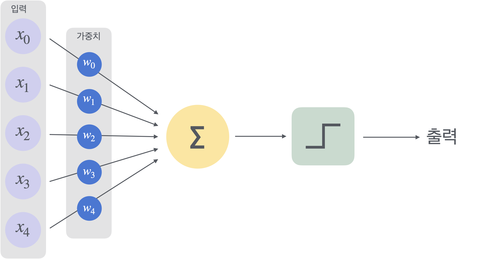

## 퍼셉트론
 - 인공 신경망의 가장 기본적인 단위로, 하나의 뉴런을 모델링한 것
 - 입력 값을 받아 가중치(weight)를 곱하고, 이를 모두 더한 후 활성화 함수(activation function)를 통해 출력 값을 결정

 

 $$ y = f(\sum_{i=1}^{n} w_i x_i + b) $$

 여기서 $x_i$는 입력 값, $w_i$는 가중치, $b$는 bias, $f$는 활성화 함수입니다.

 ## 다층 퍼셉트론
- 다층 퍼셉트론(Multi-Layer Perceptron, MLP)은 여러 층의 퍼셉트론을 쌓아 올린 신경망 구조입니다.
- MLP는 입력층(input layer), 은닉층(hidden layer), 출력층(output layer)으로 구성되며, 각 층의 뉴런들이 서로 연결되어 있습니다.

