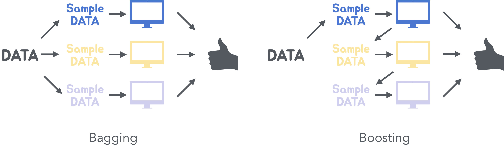
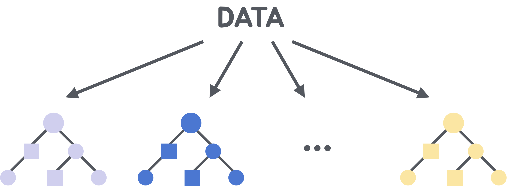

# 앙상블 학습(Ensemble Learning)
- 여러 개의 학습 모델을 결합하여 하나의 강력한 모델을 만드는 기법
- 개별 모델의 예측을 결합, 단일 모델보다 더 높은 예측 성능과 일반화 능력 발휘
- 배깅(Bagging)과 부스팅(Boosting)이 존재.



### 1. 배깅(Bootstrap Aggregating)
- 여러 개의 학습 모델을 병렬로 학습시키고, 그 예측 결과를 평균 또는 다수결로 결합하는 앙상블 기법
- 데이터의 샘플링 과정에서 부트스트래핑 기법을 사용하여, 원본 데이터셋에서 중복을 허용한 무작위 샘플을 생성

```python
from sklearn.ensemble import BaggingRegressor  # 배깅 모델
from sklearn.tree import DecisionTreeRegressor
from sklearn.metrics import mean_squared_error
from sklearn.datasets import load_breast_cancer
from sklearn.model_selection import train_test_split
from sklearn.preprocessing import StandardScaler

# 유방암 데이터 로드
cancer_data = load_breast_cancer()
X, y = cancer_data.data, cancer_data.target

# 데이터 분할
X_train, X_test, y_train, y_test = train_test_split(X, y, test_size=0.2, random_state=42)

# 데이터 스케일링
scaler = StandardScaler()
X_train_scaled = scaler.fit_transform(X_train)
X_test_scaled = scaler.transform(X_test)

# 배깅 모델 생성
bagging_model = BaggingRegressor(estimator=DecisionTreeRegressor(), n_estimators=100, random_state=42)

# 모델 학습
bagging_model.fit(X_train_scaled, y_train)

# 예측
y_pred_bagging = bagging_model.predict(X_test_scaled)

# 평가
mse_bagging = mean_squared_error(y_test, y_pred_bagging)
print(f'배깅 모델의 MSE: {mse_bagging}')
```

### 2. 부스팅(Boosting)
- 여러 개의 약한 학습기(weak learner)를 순차적으로 학습시키고, 그 예측 결과를 결합하여 강한 학습기(strong learner)를 만드는 앙상블 기법
- 이전 모델이 잘못 예측한 데이터 포인트에 가중치를 부여하여, 다음 모델이 이를 더 잘 학습하도록 유도

```python
from sklearn.ensemble import GradientBoostingRegressor # 부스팅 모델
from sklearn.tree import DecisionTreeRegressor
from sklearn.metrics import mean_squared_error
from sklearn.datasets import load_breast_cancer
from sklearn.model_selection import train_test_split
from sklearn.preprocessing import StandardScaler

# 유방암 데이터 로드
cancer_data = load_breast_cancer()
X, y = cancer_data.data, cancer_data.target

# 데이터 분할
X_train, X_test, y_train, y_test = train_test_split(X, y, test_size=0.2, random_state=42)

# 데이터 스케일링
scaler = StandardScaler()
X_train_scaled = scaler.fit_transform(X_train)
X_test_scaled = scaler.transform(X_test)

# 부스팅 모델 생성
boosting_model = GradientBoostingRegressor(n_estimators=100, random_state=42)

# 모델 학습
boosting_model.fit(X_train_scaled, y_train)

# 예측
y_pred_boosting = boosting_model.predict(X_test_scaled)

# 평가
mse_boosting = mean_squared_error(y_test, y_pred_boosting)
print(f'부스팅 모델의 MSE: {mse_boosting}')
```  

---
## 랜덤 포레스트 (Random Forest)
- 배깅(Bagging) 기법을 기반으로 한 앙상블 학습 모델
- 여러 개의 결정 트리(Decision Tree)를 학습시키고, 그 예측 결과를 결합하여 최종 예측을 수행
- 각 결정 트리는 데이터의 무작위 샘플을 사용하여 학습되며, 트리의 예측 결과를 평균 또는 다수결로 결합하여 최종 예측을 수행
- 각 트리가 독립적으로 학습되어 과적합을 방지하고 예측 성능 향상 가능

  

&nbsp;
1. **부트스트랩 샘플링**: 원본 데이터셋에서 중복을 허용한 무작위 샘플을 생성
2. **결정 트리 학습**: 각 부트스트랩 샘플을 사용하여 결정 트리 학습 (각 노드에서 무작위로 선택된 특성의 일부만을 사용하여 분할 수행)
3. **예측 결합**: 모든 결정 트리의 예측 결과를 결합하여 최종 예측을 수행 (회귀 문제 = 평균 / 분류 문제 = 다수결 사용)

```python
from sklearn.ensemble import BaggingRegressor
from sklearn.tree import DecisionTreeRegressor
from sklearn.metrics import mean_squared_error
from sklearn.datasets import load_breast_cancer
from sklearn.model_selection import train_test_split
from sklearn.preprocessing import StandardScaler

# 유방암 데이터 로드
cancer_data = load_breast_cancer()
X, y = cancer_data.data, cancer_data.target

# 데이터 분할
X_train, X_test, y_train, y_test = train_test_split(X, y, test_size=0.2, random_state=42)

# 데이터 스케일링
scaler = StandardScaler()
X_train_scaled = scaler.fit_transform(X_train)
X_test_scaled = scaler.transform(X_test)

from sklearn.ensemble import RandomForestRegressor
from sklearn.metrics import mean_squared_error

# 랜덤 포레스트 모델 생성
rf_model = RandomForestRegressor(n_estimators=100, random_state=42)

# 모델 학습
rf_model.fit(X_train_scaled, y_train)

# 예측
y_pred_rf = rf_model.predict(X_test_scaled)

# 평가
mse_rf = mean_squared_error(y_test, y_pred_rf)
print(f'랜덤 포레스트 모델의 MSE: {mse_rf}')

import matplotlib.pyplot as plt
import seaborn as sns

# 특성 중요도 추출
feature_importances = rf_model.feature_importances_

# 특성 중요도를 데이터프레임으로 변환
feature_importances_df = pd.DataFrame({
    'Feature': X.columns,
    'Importance': feature_importances
})

# 중요도 순으로 정렬
feature_importances_df = feature_importances_df.sort_values(by='Importance', ascending=False)

# 특성 중요도 시각화
plt.figure(figsize=(10, 7))
sns.barplot(x='Importance', y='Feature', data=feature_importances_df)
plt.title('Feature Importances in Random Forest')
plt.show()
```

---
## GBM (Gradient Boosting Machine)
- 여러 개의 약한 학습기(weak learner)를 순차적으로 학습시키고, 그 예측 결과를 결합하여 강한 학습기(strong learner)를 만드는 앙상블 기법
- 이전 모델이 잘못 예측한 데이터 포인트에 가중치를 부여하여, 다음 모델이 이를 더 잘 학습하도록 유도

1. **초기 모델 학습** : 첫 번째 결정 트리를 학습시켜 초기 모델 생성
2. **잔여 오차 계산** : 초기 모델의 예측 결과와 실제값 간의 잔여 오차를 계산
3. **잔여 오차 학습** : 잔여 오차를 예측하는 새로운 결정 트리를 학습
4. **모델 업데이트** : 새로운 결정 트리를 기존 모델에 추가하여 모델 업데이트
5. **반복** : 잔여 오차가 충분히 작아질 때까지 2~4 단계 반복

```python
from sklearn.ensemble import BaggingRegressor
from sklearn.tree import DecisionTreeRegressor
from sklearn.metrics import mean_squared_error
from sklearn.datasets import load_breast_cancer
from sklearn.model_selection import train_test_split
from sklearn.preprocessing import StandardScaler

# 유방암 데이터 로드
cancer_data = load_breast_cancer()
X, y = cancer_data.data, cancer_data.target

# 데이터 분할
X_train, X_test, y_train, y_test = train_test_split(X, y, test_size=0.2, random_state=42)

# 데이터 스케일링
scaler = StandardScaler()
X_train_scaled = scaler.fit_transform(X_train)
X_test_scaled = scaler.transform(X_test)

from sklearn.ensemble import GradientBoostingRegressor
from sklearn.metrics import mean_squared_error

# GBM 모델 생성
gbm_model = GradientBoostingRegressor(n_estimators=100, learning_rate=0.1, max_depth=3, random_state=42)

# 모델 학습
gbm_model.fit(X_train_scaled, y_train)

# 예측
y_pred_gbm = gbm_model.predict(X_test_scaled)

# 평가
mse_gbm = mean_squared_error(y_test, y_pred_gbm)
print(f'GBM 모델의 MSE: {mse_gbm}')
```