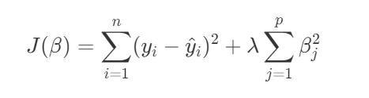
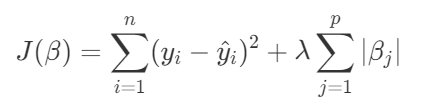
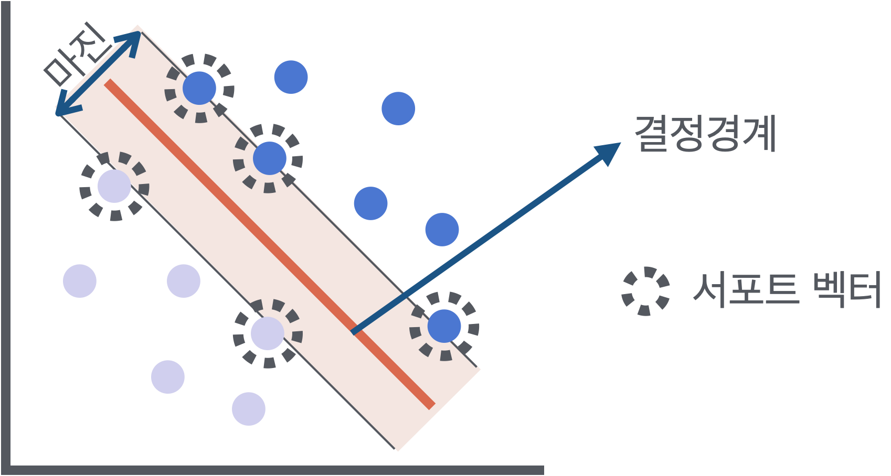
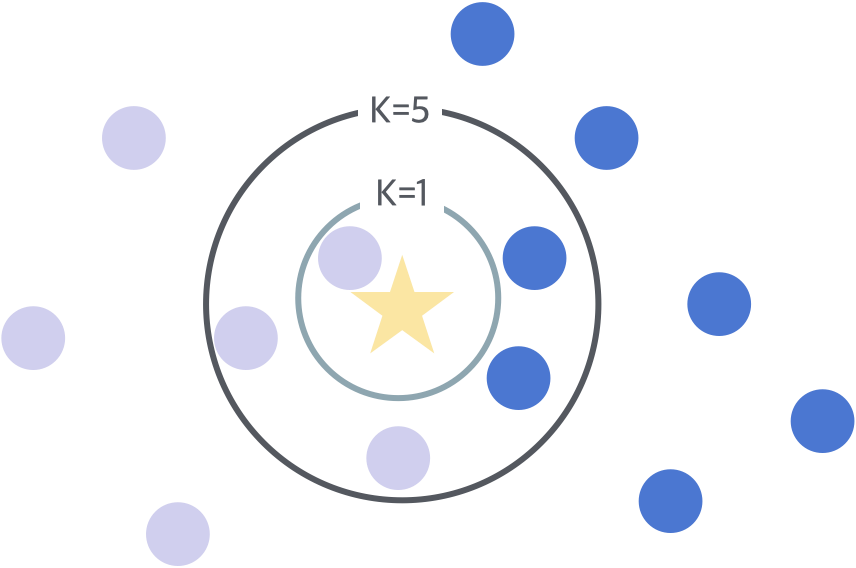
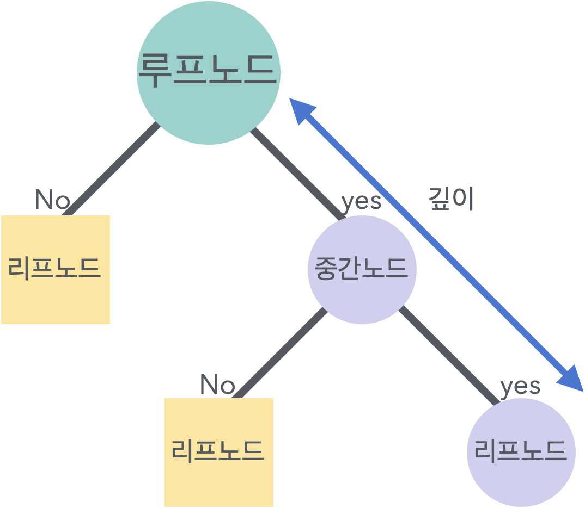
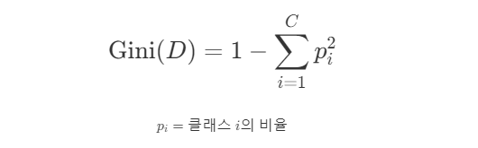

# 회귀 모델(Regression Model)

### 머신 러닝
**1. 훈련 데이터 (Training Data)**
 - 가중치 업데이트
  모델의 가중치값은 훈련 데이터를 사용하여 업데이트됩니다. 훈련 과정에서 모델은 훈련 데이터를 통해 패턴을 학습하고, 손실 함수를 최소화하기 위해 가중치를 조정합니다.
 - 학습 과정
 모델은 훈련 데이터를 사용하여 입력과 출력 사이의 관계를 학습합니다. 이 과정에서 모델은 가중치를 업데이트하여 예측의 정확도를 향상시킵니다.

**2. 테스트 데이터 (Test Data)**
 - 성능 평가
  테스트 데이터는 모델을 학습하는 데 사용되지 않으며, 모델의 일반화 능력을 평가하는 데 사용됩니다. 즉, 훈련 데이터에 대해 학습한 모델이 실제 데이터(테스트 데이터)에서 얼마나 잘 작동하는지를 측정하는 데 사용됩니다.
 - 가중치 변화 없음
  테스트 데이터는 모델의 가중치에 영향을 미치지 않습니다. 모델이 훈련을 통해 이미 설정된 가중치를 가지고 있을 때, 테스트 데이터로 예측을 수행하고 결과를 평가합니다.

**3. 모델 평가의 중요성**
 - 일반화 능력 평가
  테스트 데이터는 모델이 새로운, 보지 않은 데이터에 대해 얼마나 잘 일반화되는지를 평가하는 데 중요한 역할을 합니다. 모델이 훈련 데이터에만 잘 맞춰져 있다면(즉, 오버피팅), 테스트 데이터에서 성능이 저하될 수 있습니다.
 - 훈련/검증/테스트 분할
  일반적으로 데이터셋은 훈련 데이터, 검증 데이터, 테스트 데이터로 분할됩니다. 검증 데이터는 하이퍼파라미터 조정 및 모델 선택을 위한 중간 평가를 제공하고, 테스트 데이터는 최종 성능을 평가하는 데 사용됩니다.

### 선형 회귀 (선형)
 - 종속 변수와 하나 이상의 독립 변수 간의 선형 관계를 모델링 하는 방법

$$y=β_0​+β_1​x_1​+ϵ$$
$$y=β_0​+β_1​x_1​+β_2​x_2​+⋯+β_n​x_n​+ϵ$$

```python
import numpy as np
import pandas as pd
from sklearn.model_selection import train_test_split
from sklearn.linear_model import LinearRegression
from sklearn.metrics import mean_squared_error, r2_score

# 데이터 생성
X = np.array([[1, 1], [2, 2], [3, 3], [4, 4], [5, 5],[6,6]])
y = np.array([1, 2, 3, 4, 5, 6])

# 데이터 분할 (훈련 데이터와 테스트 데이터)
X_train, X_test, y_train, y_test = train_test_split(X, y, test_size=0.2, random_state=42)
# random_state 의 값은 난수의 초기값을 의미하므로, 설정을 하는 것 자체에 의미를 둔다. 값은 중요X

# 선형 회귀 모델 생성 및 학습
model = LinearRegression()
model.fit(X_train, y_train)

# 예측
y_pred = model.predict(X_test)
a = list(map(float,y_pred))
print(a)  # [1.0000000000000013, 2.000000000000001]

# 모델 평가 (y_test는 정답, y_pred는 모델의 예측값)
mse = mean_squared_error(y_test, y_pred)
r2 = r2_score(y_test, y_pred)
print(f'Mean Squared Error: {mse}')  # 테스트 데이터에 대한 MSE 출력
print(f'R^2 Score: {r2}')  # 테스트 데이터에 대한 R² Score 출력
```
**KeyPoint**
`random_state`의 역할은 주어진 `X(특징)`와 `Y(타겟)` 데이터 셋의 조합을 바꾸는 것이 아니라, `train data`와 `test data`를 랜덤하게 나누는 과정에서 무작위성을 부여하는 것이다.

&nbsp;

### 다항 회귀 (비선형 feature, 선형 model)
  - 종속 변수와 독립 변수 간의 비선형 관계를 모델링하는 방법
  - 다항회귀 차수(degree) : 독립 변수의 최대 차수(n)
  - 차수가 높을수록 모델이 더 복잡해지며 과적합(overfitting)의 위험 → 적절한 차수 선택 필요

$$y=β_0​+β_1​x+β_2​x^2+⋯+β_n​x^n+ϵ$$

```python
import numpy as np
import pandas as pd
from sklearn.model_selection import train_test_split
from sklearn.preprocessing import PolynomialFeatures
from sklearn.linear_model import LinearRegression
from sklearn.metrics import mean_squared_error, r2_score

# 데이터 생성
X = np.array([[1], [2], [3], [4], [5], [6]])
y = np.array([1, 4, 9, 16, 25, 36])

# 다항 특징 생성 (차수 2)
poly = PolynomialFeatures(degree=2)
X_poly = poly.fit_transform(X)

# 데이터 분할 (훈련 데이터와 테스트 데이터)
X_train, X_test, y_train, y_test = train_test_split(X_poly, y, test_size=0.2, random_state=42)
# random_state 의 값은 난수의 초기값을 의미하므로, 설정을 하는 것 자체에 의미를 둔다. 값은 크게 중요X

# 다항 회귀 모델 생성 및 학습
model = LinearRegression()
model.fit(X_train, y_train)

# 예측
y_pred = model.predict(X_test)

# 모델 평가
mse = mean_squared_error(y_test, y_pred)
r2 = r2_score(y_test, y_pred)
print(f'Mean Squared Error: {mse}')  # 테스트 데이터에 대한 MSE 출력
print(f'R^2 Score: {r2}')  # 테스트 데이터에 대한 R² Score 출력
```
**KeyPoint**
`X_poly`에 포함되는 변수들은 기존 `X`의 0차~n차 항 만큼의 변수들이 추가되어 포함된다.

&nbsp;
### 리지 회귀 (선형)
- 회귀 계수의 크기를 제어하여 과적합을 방지하는 정규화 기법
- L2 정규화(regularization)를 사용하여 회귀 계수의 제곱합을 최소화
- $\lambda$ 는 정규화 강도를 조절하는 hyper_parameter



```python
import numpy as np
import pandas as pd
from sklearn.model_selection import train_test_split
from sklearn.linear_model import Ridge
from sklearn.metrics import mean_squared_error, r2_score

# 데이터 생성
X = np.array([[1, 1], [2, 2], [3, 3], [4, 4], [5, 5], [6, 6]])
y = np.array([1, 2, 3, 4, 5, 6])

# 데이터 분할 (훈련 데이터와 테스트 데이터)
X_train, X_test, y_train, y_test = train_test_split(X, y, test_size=0.2, random_state=42)

# 리지 회귀 모델 생성 및 학습
model = Ridge(alpha=1.0)
model.fit(X_train, y_train)

# 예측
y_pred = model.predict(X_test)

# 모델 평가
mse = mean_squared_error(y_test, y_pred)
r2 = r2_score(y_test, y_pred)
print(f'Mean Squared Error: {mse}')  # 테스트 데이터에 대한 MSE 출력
print(f'R^2 Score: {r2}')  # 테스트 데이터에 대한 R² Score 출력
```
&nbsp;
### 라쏘 회귀 (선형)
- 회귀 계수의 크기를 제어하여 과적합을 방지하는 정규화 기법
- L1 정규화(regularization)를 사용하여 회귀 계수의 절대값 합을 최소화
- $\lambda$ 는 정규화 강도를 조절하는 hyper_parameter



```python
import numpy as np
import pandas as pd
from sklearn.model_selection import train_test_split
from sklearn.linear_model import Lasso
from sklearn.metrics import mean_squared_error, r2_score

# 데이터 생성
X = np.array([[1, 1], [2, 2], [3, 3], [4, 4], [5, 5], [6,6]])
y = np.array([1, 2, 3, 4, 5, 6])

# 데이터 분할 (훈련 데이터와 테스트 데이터)
X_train, X_test, y_train, y_test = train_test_split(X, y, test_size=0.2, random_state=42)

# 라쏘 회귀 모델 생성 및 학습
model = Lasso(alpha=1.0)
model.fit(X_train, y_train)

# 예측
y_pred = model.predict(X_test)

# 모델 평가
mse = mean_squared_error(y_test, y_pred)
r2 = r2_score(y_test, y_pred)
print(f'Mean Squared Error: {mse}')  # 테스트 데이터에 대한 MSE 출력
print(f'R^2 Score: {r2}')  # 테스트 데이터에 대한 R² Score 출력
```

**L1 정규화**

- 일부 회귀 계수를 0으로 만들어 특징 선택(feature selection)을 수행
- 모델의 해석 가능성을 높이고, 불필요한 특징을 제거하는 데 유용

**L2 정규화**

- 모든 가중치를 작게 만들어 모델의 복잡도 축소
- 손실 함수에 제곱항을 추가하여 매끄러운 최적화 가능
&nbsp;
### 로지스틱 회귀
- 종속 변수가 이진형일 때(결과값이 2개일 때) 사용되는 통계 기법
- 선형 회귀와 달리 결과값이 0과 1 사이에 위치하게 하기 위해 시그모이드 함수(Sigmoid Function)를 사용
- 각 데이터 포인트가 특정 클래스에 속할 확률을 예측
- $z=β_0​+β_1​x+β_2​x^2+⋯+β_n​x^n$ 인 `z`에 대해,

$$\sigma(z) = \frac{1}{1 + e^{-z}}$$

**비용 함수**
<small>
- 모델의 예측 확률과 실제 레이블 사이의 차이를 측정
- Log Loss function 또는 Cross-Entropy loss function 으로 불림
</small>

$$J(\theta) = -\frac{1}{m} \sum_{i=1}^{m} \left[ y^{(i)} \log(h_\theta(x^{(i)})) + (1 - y^{(i)}) \log(1 - h_\theta(x^{(i)})) \right]$$

&nbsp;
### 로지스틱 회귀 실습 (1)

```python
##### 유방암 데이터 로드/전처리 #####
import numpy as np
import pandas as pd
from sklearn.datasets import load_breast_cancer
from sklearn.model_selection import train_test_split
from sklearn.preprocessing import StandardScaler

# 데이터 로드
data = load_breast_cancer()
X = data.data 
y = data.target
# return_X_y = True 설정 시, data, target 동시 반환
# X, y = load_breast_cancer(return_X_y=True)

# 데이터 분할
X_train, X_test, y_train, y_test = train_test_split(X, y, test_size=0.2, random_state=42)

# 데이터 스케일링
scaler = StandardScaler()  # 평균 0, 분산 1로 스케일링
X_train = scaler.fit_transform(X_train)
X_test = scaler.transform(X_test) # 테스트 데이터는 평가왜곡 방지를 위해 전처리과정(스케일링) 제외

##### 모델 학습 #####
from sklearn.linear_model import LogisticRegression
from sklearn.metrics import accuracy_score, classification_report, confusion_matrix

# 모델 생성 및 학습
model = LogisticRegression()
model.fit(X_train, y_train)

# 예측
y_pred = model.predict(X_test)

# 평가
print(f"Accuracy: {accuracy_score(y_test, y_pred)}")
print(f"Classification Report:\n{classification_report(y_test, y_pred)}") # 분류 보고서 생성
print(f"Confusion Matrix:\n{confusion_matrix(y_test, y_pred)}") # 혼동 행렬 생성
```
**혼동 행렬이란?**
<small>모델의 예측 결과를 실제 클래스와 비교하여 얼마나 잘 예측했는지를 나타내는 표 형태의 데이터 구조</small>
```python
                  Predicted
            Positive    Negative
          +-----------------------+
          |    TP     |    FN     |
          |-----------------------|
          |    FP     |    TN     |
          +-----------------------+
```
- True Positive (TP): 실제로 긍정인 샘플을 모델이 긍정으로 정확히 예측한 수.
- True Negative (TN): 실제로 부정인 샘플을 모델이 부정으로 정확히 예측한 수.
- False Positive (FP): 실제로 부정인 샘플을 모델이 긍정으로 잘못 예측한 수 (1종 오류).
- False Negative (FN): 실제로 긍정인 샘플을 모델이 부정으로 잘못 예측한 수 (2종 오류).
&nbsp;
### 로지스틱 회귀 실습 (2)
```python
import seaborn as sns

# 데이터 로드
titanic = sns.load_dataset('titanic')

# 필요한 열 선택 및 결측값 처리
titanic = titanic[['survived', 'pclass', 'sex', 'age', 'sibsp', 'parch', 'fare', 'embarked']].dropna()

# 성별과 탑승한 곳 인코딩
titanic['sex'] = titanic['sex'].map({'male': 0, 'female': 1})
titanic['embarked'] = titanic['embarked'].map({'C': 0, 'Q': 1, 'S': 2})  # 탑승한 곳을 숫자로 매핑

# 특성과 타겟 분리
X = titanic.drop('survived', axis=1) # delete `survived` for featured data
y = titanic['survived'] # insert `survived` to target data

# 데이터 분할
X_train, X_test, y_train, y_test = train_test_split(X, y, test_size=0.2, random_state=42)

# 데이터 스케일링
scaler = StandardScaler()
X_train = scaler.fit_transform(X_train)
X_test = scaler.transform(X_test)

# 모델 생성 및 학습
model = LogisticRegression()
model.fit(X_train, y_train)

# 예측
y_pred = model.predict(X_test)

# 평가
print(f"Accuracy: {accuracy_score(y_test, y_pred)}")
print(f"Classification Report:\n{classification_report(y_test, y_pred)}")
print(f"Confusion Matrix:\n{confusion_matrix(y_test, y_pred)}")
```

---

&nbsp;

### 그 외 다양한 분류 모델들

**1. SVM (Support Vector Machine)**
- 데이터를 분류하기 위해 결정 경계(결정 초평면, hyperplane)를 찾아 분류
- 초평면은 두 클래스 사이의 최대 마진이 되는 지점 

즉, 성향이 다른 부류의 data를 가장 보편적으로 나눌 수 있는 경계를 찾는 모델



$$ \mathbf{w} \cdot \mathbf{x} - b = 0 $$
```python
w : weight vector
x : input vector
b : section

Margin : 두 클래스 간의 가장 가까운 data point 사이의 거리
Support vector : 결정 초평면에 가장 가까이 위치한 data point
kernel function : data를 더 높은 차원으로 mapping하여 선형적으로 분리 할 수 없는 data를 분리하게 유도

# 사용 예시
from sklearn.svm import SVC
model = SVC(kernel='linear')
model.fit(X_train, y_train)
```

&nbsp;

**2. KNN (K Nearest Neighbors)**
- 분류와 회귀 분석에 사용되는 비모수적 방법 (parameter 의존성 낮음)
- 새로운 데이터 포인트를 기존 데이터 포인트 중 가장 가까운 K개의 이웃과 비교하여 분류
- 데이터 포인트의 특성을 기준으로 가장 가까운 이웃 탐색
- 학습 데이터를 기반으로 새로운 데이터 포인트의 클래스를 예측



&nbsp;
```python
from sklearn.neighbors import KNeighborsClassifier
model = KNeighborsClassifier(n_neighbors=5)
model.fit(X_train, y_train)
```

&nbsp;

**3. 나이브베이즈 (Naive Bayes)**
- 베이즈 정리를 기반으로 하는 통계적 분류 기법
- 각 특징(feature)이 독립적이라고 가정
- 주어진 데이터 포인트가 특정 클래스에 속할 확률을 계산하여 분류
- 주로 텍스트 분류 문제에서 널리 사용

$$ P(A|B) = \frac{P(B|A) \cdot P(A)}{P(B)} $$
>*P*(*A*∣*B*) : B가 주어졌을 때 A의 확률 (사후 확률)
>*P*(*B*∣*A*) : A가 주어졌을 때 B의 확률 (우도)
>*P*(*A*) : A의 사전 확률
>*P*(*B*) : B의 사전 확률

```python
Gaussian NB : 특징들이 연속적이고 정규 분포를 따르는 경향일 때 사용
Bernoulli NB : 특징들이 이진수(0,1)로 표현되는 경우 사용
Multinomial NB : 특징들이 다항 분포를 따르는 경우 사용

from sklearn.naive_bayes import GaussianNB
model = GaussianNB()
model.fit(X_train, y_train)
```

&nbsp;

**4. 의사결정 나무 (Decision Tree)**
- 데이터의 특징(feature)을 기준으로 의사결정 규칙을 만들고 이를 바탕으로 데이터를 분류/회귀하는 데 사용
- 의사결정나무는 트리 구조를 가지며, 각 내부 노드(Node)는 데이터의 특징에 대한 테스트를 나타내고, 각 가지(branch)는 테스트 결과를 나타내며, 각 리프 노드(leaf)는 클래스 레이블을 표현



&nbsp;

>노드 : 하나의 특징(feature)에 대한 테스트  
>루트 노드 : 트리의 최상위 노드로, 전체 데이터셋을 상징  
>리프 노드 : 트리의 끝 노드로, 최종 클래스 레이블을 상징  
>깊이 : 트리의 루트 노드부터 리프 노드까지의 최대 거리  
>분할 기준 : 노드를 나눌 때 사용하는 기준. (Information Gain, Gini Index)

- 정보 이득(Information Gain)  
<small>엔트로피(Entropy)값으로 데이터를 나누는 기준. 엔트로피가 낮을수록 불확실성이 적다.</small>

$$
\text{Information Gain}(D, A) = \text{Entropy}(D) - \sum_{v \in \text{values}(A)} \frac{|D_v|}{|D|} \text{Entropy}(D_v)
$$

- 지니 계수(Gini Index)  
  <small>불순도를 측정하는 방법. 지니 계수가 낮을수록 불순도가 적다.</small>
    


<small>

예를 들어, p1 = 0.5 이고, p2 = 0.5 인 상황이면, 식에 따라 지니 계수 D는
$D_1 = 1 - {(0.5)^2+(0.5)^2} = 0.5$ 가 된다.  

하지만 p1 = 0.9 이고, p2 = 0.1 인 상황을 가정하면, 지니 계수 D는
$D_2 = 1 - {(0.9)^2+(0.1)^2} = 0.18$ 이 되어 이전보다 더 낮은 계수값을 가지게 되고, 이렇게 나뉜 클래스의 비율이 불순도가 더 적은 경우이므로, D2 가 분할기준에 더 적합하다고 할 수 있다.
</small>

```python
from sklearn.tree import DecisionTreeClassifier
model = DecisionTreeClassifier(random_state=42)  # random 시드는 트리의 재현성을 위해 사용
model.fit(X_train, y_train)
```