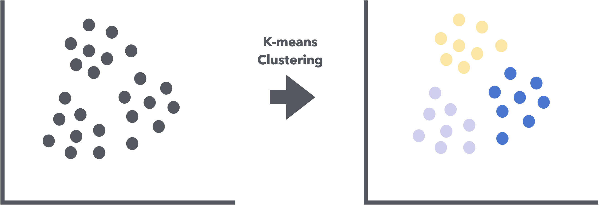
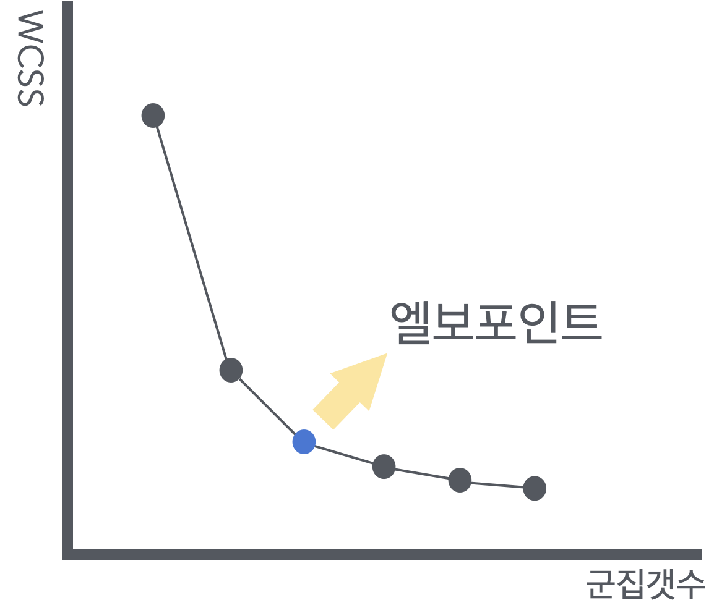
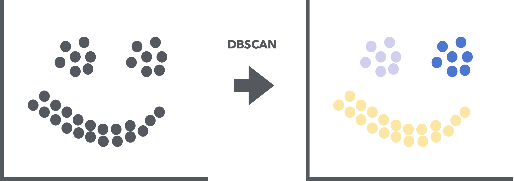
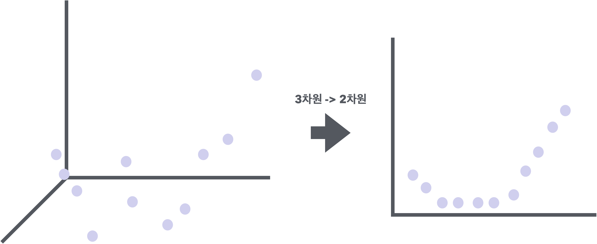
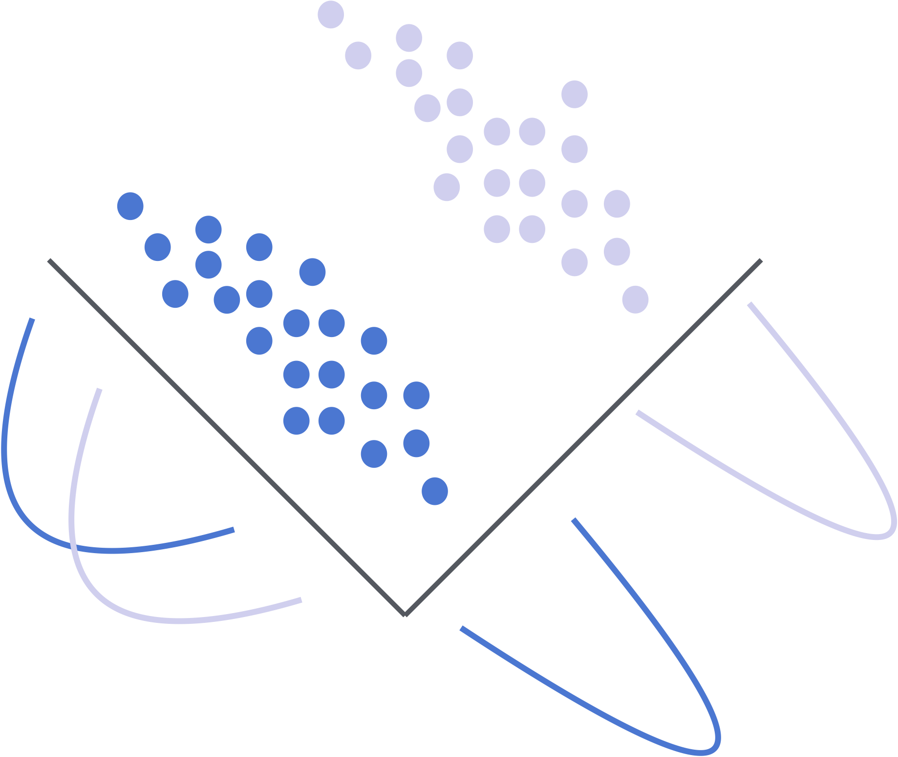

# 군집화 (Clustering)
### k-means clustering
1. **초기화** : k개의 군집 중심을 랜덤하게 설정
2. **할당** : 각 데이터 포인트를 가장 가까운 군집 중심에 할당
3. **업데이트** : 각 군집의 중심을 해당 군집에 속한 데이터 포인트들의 평균으로 업데이트
4. **반복** : 할당과 업데이트를 군집 중심이 더 이상 변화하지 않을 때까지 반복



&nbsp;



k를 증가시키면서 각 k에 대한 군집의 응집도를 계산하고, 이를 그래프로 나타내어 그래프에서 응집도가 급격히 감소하는 지점으로 최적의 k 선택  
> k를 증가시킬수록 전체 군집의 면적은 작아지지만 군집 개수가 늘어나므로, 전체 군집의 면적을 가장 효율적으로 최소화할 수 있는 최적의 k값을 찾는데 목적이 있음.  
($k*WCSS$ 값이 최소가 되는 지점)

&nbsp;
**그래프 라이브러리**
- `matplotlib.pyplot.plot`
    - K, inertia, 'bx-' : x축, y축, 그래프 스타일을 설정
- `seaborn.scatterplot`
    - x=data['Age'] : x축 데이터
    - y=data['Annual Income (k\$)'] : y축 데이터
    - hue=data['Cluster'] : 색상에 따라 군집을 구분
    - palette='viridis' : 색상 팔레트 설정

```python
import numpy as np
import pandas as pd
from sklearn.preprocessing import StandardScaler
from sklearn.cluster import KMeans  # k_means
import matplotlib.pyplot as plt  # pyplot
import seaborn as sns

# 데이터 로드
data = pd.read_csv('Mall_Customers.csv')

# 필요한 열 선택 및 결측값 처리
data = data[['Age', 'Annual Income (k$)', 'Spending Score (1-100)']]

# 데이터 스케일링
scaler = StandardScaler()
data_scaled = scaler.fit_transform(data)

# 최적의 k 찾기 (엘보우 방법)
inertia = []
K = range(1, 11)
for k in K:
    model = KMeans(n_clusters=k, random_state=42)
    model.fit(data_scaled)
    inertia.append(model.inertia_)

# 엘보우 그래프 그리기
plt.figure(figsize=(10, 8))
plt.plot(K, inertia, 'bx-')
plt.xlabel('k')
plt.ylabel('Inertia')
plt.title('Elbow Method For Optimal k')
plt.show()

# k=5로 모델 생성 및 학습
model = KMeans(n_clusters=5, random_state=42)
model.fit(data_scaled)

# 군집 결과 할당
data['Cluster'] = model.labels_

# 2차원으로 군집 시각화 (연령 vs 소득)
plt.figure(figsize=(10, 8))
sns.scatterplot(x=data['Age'], y=data['Annual Income (k$)'], hue=data['Cluster'], palette='viridis')
plt.title('Clusters of customers (Age vs Annual Income)')
plt.show()

# 2차원으로 군집 시각화 (소득 vs 지출 점수)
plt.figure(figsize=(10, 8))
sns.scatterplot(x=data['Annual Income (k$)'], y=data['Spending Score (1-100)'], hue=data['Cluster'], palette='viridis')
plt.title('Clusters of customers (Annual Income vs Spending Score)')
plt.show()
```
&nbsp;
### 계층적 군집화(Hierarchical Clustering)
- 데이터 포인트를 계층 구조로 그룹화하는 방법
- 데이터 포인트를 점진적으로 병합하거나 분할하여 군집을 형성
- 병합 군집화 : 각 데이터 포인트를 개별 군집으로 시작, 가장 가까운 군집을 반복적으로 병합 (bottom-up / simple dataset)
- 분할 군집화 : 모든 데이터 포인트를 하나의 군집으로 시작, 반복적으로 가장 멀리 떨어진 군집을 분할 (top-down / large dataset)

**적용 방식**
<small>
1. 거리 행렬 계산 : 데이터 포인트 간의 거리를 계산하여 거리 행렬 생성
2. 군집 병합/분할 : 거리 행렬을 기반으로 가장 가까운 군집을 병합/분할
3. 덴드로그램 생성 : 군집화 과정을 시각화한 덴드로그램 생성
</small>

```PYTHON
import pandas as pd
import numpy as np
import matplotlib.pyplot as plt
from sklearn.preprocessing import StandardScaler
from sklearn.cluster import AgglomerativeClustering  # 계층 군집화
import scipy.cluster.hierarchy as sch  # 계층 군집화

# 데이터셋 불러오기
df = pd.read_csv('Mall_Customers.csv')
print(df.head())

# 필요한 열만 선택
X = df[['Age', 'Annual Income (k$)', 'Spending Score (1-100)']]

# 데이터 정규화
scaler = StandardScaler()
X_scaled = scaler.fit_transform(X)

# 덴드로그램 생성
plt.figure(figsize=(10, 7))
dendrogram = sch.dendrogram(sch.linkage(X_scaled, method='ward'))
plt.title('Dendrogram')
plt.xlabel('Customers')
plt.ylabel('Euclidean distances')
plt.show()

# 계층적 군집화 모델 생성
hc = AgglomerativeClustering(n_clusters=5, metric='euclidean', linkage='ward')

# 모델 학습 및 예측
y_hc = hc.fit_predict(X_scaled)

# 결과 시각화
plt.figure(figsize=(10, 7))
plt.scatter(X_scaled[y_hc == 0, 0], X_scaled[y_hc == 0, 1], s=100, c='red', label='Cluster 1')
plt.scatter(X_scaled[y_hc == 1, 0], X_scaled[y_hc == 1, 1], s=100, c='blue', label='Cluster 2')
plt.scatter(X_scaled[y_hc == 2, 0], X_scaled[y_hc == 2, 1], s=100, c='green', label='Cluster 3')
plt.scatter(X_scaled[y_hc == 3, 0], X_scaled[y_hc == 3, 1], s=100, c='cyan', label='Cluster 4')
plt.scatter(X_scaled[y_hc == 4, 0], X_scaled[y_hc == 4, 1], s=100, c='magenta', label='Cluster 5')
plt.title('Clusters of customers')
plt.xlabel('Age')
plt.ylabel('Annual Income (k$)')
plt.legend()
plt.show()

from sklearn.metrics import silhouette_score

# 실루엣 점수 계산
silhouette_avg = silhouette_score(X_scaled, y_hc)
print(f'Silhouette Score: {silhouette_avg}')
```
&nbsp;
### DBSCAN (Density-Based Spatial Clustering of Applications with Noise)
- 밀도 기반 군집화 알고리즘
- **비구형 군집 탐지**
- **노이즈 처리**
- **군집 수 자동 결정**
- 데이터 밀도가 높은 영역을 군집으로 간주하고, 밀도가 낮은 영역은 노이즈로 처리



&nbsp;
1. 임의의 데이터 포인트를 선택
2. 선택한 데이터 포인트의 epsilon 반경 내에 있는 모든 데이터 포인트 탐색
    - epsilon 반경 내의 데이터수 ≥ min_samples : 선택한 데이터 포인트를 중심으로 새로운 군집 형성.
    - epsilon 반경 내의 데이터수 < min_samples : 선택한 데이터 포인트를 노이즈로 간주
3. 군집에 속한 데이터 포인트에 대해 1~2단계를 반복
4. 모든 데이터 포인트가 처리될 때까지 이 과정을 반복

```python
from sklearn.cluster import DBSCAN

# DBSCAN 모델 생성
dbscan = DBSCAN(eps=5, min_samples=5)

# 모델 학습 및 예측
df['Cluster'] = dbscan.fit_predict(X)

# 군집화 결과 시각화
plt.figure(figsize=(10, 7))
sns.scatterplot(x='Annual Income (k$)', y='Spending Score (1-100)', hue='Cluster', data=df, palette='viridis')
plt.title('DBSCAN Clustering of Mall Customers')
plt.show()

# 다양한 eps와 min_samples 값 시도
eps_values = [3, 5, 7, 10]
min_samples_values = [3, 5, 7, 10]

for eps in eps_values:
    for min_samples in min_samples_values:
        dbscan = DBSCAN(eps=eps, min_samples=min_samples)
        df['Cluster'] = dbscan.fit_predict(X)
        
        plt.figure(figsize=(10, 7))
        sns.scatterplot(x='Annual Income (k$)', y='Spending Score (1-100)', hue='Cluster', data=df, palette='viridis')
        plt.title(f'DBSCAN Clustering (eps={eps}, min_samples={min_samples})')
        plt.show()
```

&nbsp;
# 차원 축소

### PCA
- 고차원 데이터를 저차원으로 변환하는 차원 축소 기법
- 데이터의 분산을 최대한 보존, 데이터의 주요 특징을 추출해 저차원 공간으로 변환



&nbsp;
1. 데이터 표준화 : 각 X의 평균 = 0, 분산 = 1로 표준화
2. 공분산 행렬 계산 : X 요소들 간의 공분산 행렬 계산
3. 고유값/고유벡터 계산 : 공분산 행렬의 고유값/고유벡터 계산
4. **주성분 선택** : 고유값이 큰 순서대로 고유벡터를 정렬하여 주성분 선택
5. 데이터 변환 : 선택된 주성분을 사용하여 데이터를 저차원 공간으로 변환

**고유값이 큰 순서대로 주성분을 선택하는 이유?**
- 고유값이 클수록 데이터들이 고유벡터에 정사영되었을 때 (차원이 축소되었을 때) 축소된 차원에서 데이터가 넓게 분포되어 있다는 뜻이고, 이는 곧 **원본 데이터의 특징에 대한 손상이 최소화**된다는 의미이기 때문이다.

<SMALL>
참고자료 (선형변환/고유값의 기하학적 의미) : https://www.youtube.com/watch?v=7dmV3p3Iy90&t=673s  

참고자료 (주성분분석/PCA) : https://www.youtube.com/watch?v=YEdscCNsinU  
</SMALL>
```python
from sklearn.datasets import fetch_openml
import pandas as pd
from sklearn.preprocessing import StandardScaler
from sklearn.decomposition import PCA
import matplotlib.pyplot as plt
import seaborn as sns

### MNIST 데이터셋 불러오기 ###
mnist = fetch_openml('mnist_784', version=1)

# 데이터와 레이블 분리
X = mnist.data
y = mnist.target

# 데이터 프레임의 첫 5행 출력
print(X.head())
print(y.head())

### 데이터 표준화 ###
scaler = StandardScaler()
X_scaled = scaler.fit_transform(X)

# 전체 분산의 95%를 설명하는 주성분 선택
pca = PCA(n_components=0.95) 

# PCA 학습 및 변환
X_pca = pca.fit_transform(X_scaled)

# 변환된 데이터의 크기 확인
print(X_pca.shape)

### 주성분 확인 ###
print(f'선택된 주성분의 수: {pca.n_components_}')
print(f'각 주성분이 설명하는 분산 비율: {pca.explained_variance_ratio_}')
print(f'누적 분산 비율: {pca.explained_variance_ratio_.cumsum()}')

# 결과값 2차원 시각화
plt.figure(figsize=(10, 7))
sns.scatterplot(x=X_pca[:, 0], y=X_pca[:, 1], hue=y, palette='viridis', legend=None)
plt.title('PCA of MNIST Dataset (2D)')
plt.xlabel('Principal Component 1')
plt.ylabel('Principal Component 2')
plt.show()
```

&nbsp;

### t-SNE (t-Distributed Stochastic Neighbor Embedding)
- 고차원 데이터를 저차원으로 변환하여 시각화하는 차원 축소 기법
- 데이터 포인트 간의 유사성을 보존하면서 고차원 데이터를 2~3차원 공간으로 변환

1. 고차원 공간에서의 유사성 계산 : 고차원 데이터 포인트 간의 유사성을 Gaussian 분포로 계산
2. 저차원 공간에서의 유사성 계산 : 저차원 데이터 포인트 간의 유사성을 t-분포를 사용하여 계산
3. **KL 발산 최소화** : 고차원 공간과 저차원 공간 간의 유사성 분포 차이를 KL 발산(Kullback-Leibler divergence)을 통해 최소화
4. 반복적 최적화 : 저차원 공간에서의 데이터 포인트 위치를 반복적으로 조정하여 최적의 시각화 도출

```python
from sklearn.datasets import fetch_openml
import pandas as pd
from sklearn.preprocessing import StandardScaler
from sklearn.manifold import TSNE
import matplotlib.pyplot as plt
import seaborn as sns

# MNIST 데이터셋 불러오기
mnist = fetch_openml('mnist_784', version=1)

# 데이터와 레이블 분리
X = mnist.data
y = mnist.target

# 데이터 프레임의 첫 5행 출력
print(X.head())
print(y.head())

# 데이터 표준화
scaler = StandardScaler()
X_scaled = scaler.fit_transform(X)

# t-SNE 모델 생성
tsne = TSNE(n_components=2, random_state=42)

# t-SNE 학습 및 변환
X_tsne = tsne.fit_transform(X_scaled)

# 변환된 데이터 크기 확인
print(X_tsne.shape)

# 2차원 시각화
plt.figure(figsize=(10, 7))
sns.scatterplot(x=X_tsne[:, 0], y=X_tsne[:, 1], hue=y, palette='viridis', legend=None)
plt.title('t-SNE of MNIST Dataset (2D)')
plt.xlabel('t-SNE Component 1')
plt.ylabel('t-SNE Component 2')
plt.show()
```

&nbsp;

### LDA (Linear Discriminant Analysis, 선형판별분석)
- 차원 축소와 분류를 동시에 수행
- 데이터의 **클래스 간 분산을 최대화**하고, **클래스 내 분산을 최소화**하는 방향으로 데이터를 변환

**선형 판별 축 선택**
- 고유값이 큰 순서대로 고유벡터를 정렬하여 선형 판별 축 선택
- 고유값이 클수록 해당 선형 판별 축이 클래스 간 분산을 더 많이 설명
- 클래스의 수 - 1 개의 선형 판별 축을 선택



1. 클래스별 평균 계산 : 각 클래스의 평균 벡터 계산
2. 클래스 내 분산 행렬 계산 : 각 클래스 내 데이터 포인트의 분산을 계산해 클래스 내 분산 행렬 생성
3. 클래스 간 분산 행렬 계산 : 클래스 간 평균 벡터의 분산을 계산하여 클래스 간 분산 행렬을 생성
4. 고유값/고유벡터 계산 : 클래스 내 분산 행렬의 역행렬과 클래스 간 분산 행렬의 곱의 고유값/고유벡터 계산
5. 선형 판별 축 선택 : 고유값이 큰 순서대로 고유벡터를 정렬하여 선형 판별 축 선택
6. 데이터 변환 : 선택된 선형 판별 축을 사용하여 데이터를 저차원 공간으로 변환

```python
from sklearn.datasets import fetch_openml
import pandas as pd
from sklearn.preprocessing import StandardScaler
from sklearn.discriminant_analysis import LinearDiscriminantAnalysis
import matplotlib.pyplot as plt
import seaborn as sns

# MNIST 데이터셋 불러오기
mnist = fetch_openml('mnist_784', version=1)

# 데이터와 레이블 분리
X = mnist.data
y = mnist.target

# 데이터 프레임의 첫 5행 출력
print(X.head())
print(y.head())

# 데이터 표준화
scaler = StandardScaler()
X_scaled = scaler.fit_transform(X)

# LDA 모델 생성 (클래스의 수 - 1 만큼의 선형 판별 축 선택)
lda = LinearDiscriminantAnalysis(n_components=9)

# LDA 학습 및 변환
X_lda = lda.fit_transform(X_scaled, y)

# 변환된 데이터의 크기 확인
print(X_lda.shape)

# 2차원 시각화
plt.figure(figsize=(10, 7))
sns.scatterplot(x=X_lda[:, 0], y=X_lda[:, 1], hue=y, palette='viridis', legend=None)
plt.title('LDA of MNIST Dataset (2D)')
plt.xlabel('LDA Component 1')
plt.ylabel('LDA Component 2')
plt.show()
```

**Math 폴더에 추가 예정인 내용**  
&nbsp;
Linear Algebra
 - linear transformation
 - eigen-value, eigen-vector

Statistics
- Covariance
- Gaussian Distribution
- t-Distribution

Calculus
- Gradient
- Gradient Descent