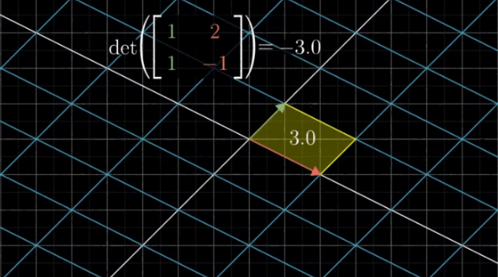
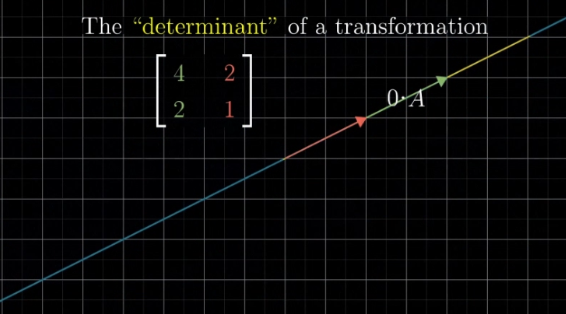

### Determinant 의 기하학적 의미

 - 각 행렬의 열좌표를 기저벡터의 방향으로 보면, determinant값은 선형 변환된 좌표계의 단위면적값과 동일.
 - 즉, det(A) 가 0이란 뜻은 기저벡터중 일부가 서로 종속관계여서 더 낮은 차원으로 축소되었음을 의미.
 - 이미 소실된 기저벡터는 역행렬만을 곱해서 복원할 수 없으므로, det(A) 가 0인 경우 역행렬은 존재하지 않음



출처 : https://blog.naver.com/songsite123/223320410409
 
위 이미지는 단위 벡터 <1,0>, <0,1> 을 가진 좌표계가 두 백터 v=<1,1> 와 w=<2,-1> 을 기저 벡터(basis vector) 로 하는 선형 변환된 것을 의미한다.

---
### **두 basis 가 선형 종속일 때**


### Reduced Row-echolon form (RRef) 특징

 - 모든 행렬은 행동치인 기약행사다리꼴을 유일하게 가진다.
 - 행렬 AA의 행동치인 기약행사다리꼴이 단위행렬 II일 필요충분 조건은 AA의 역행렬이 존재한다는 것이다.
 - 해당 행렬이 정사각행렬이면 행렬식이 0이 아니다.
 - 임의의 행렬 AA의 계수(rank)는 행동치인 행사다리꼴의 0이 아닌 행의 개수[4]와 같고, 퇴화차수(nullity)는 leading entry가 존재하지 않는 열의 개수와 같다.
 - AA의 행동치인 행사다리꼴에서 leading entry가 존재하는 열의 위치를 i1,⋯ ,iri1​,⋯,ir​이라고 하고, AiAi​를 AA의 ii열이라고 하면, {Ai1,⋯ ,Air}{Ai1​​,⋯,Air​​}은 AA의 열공간의 기저이다.

(출처 : 나무위키 https://namu.wiki/w/%ED%96%89%EC%82%AC%EB%8B%A4%EB%A6%AC%EA%BC%B4)

 

### 전치 행렬(Traspose Matrix)

 - 대각 행렬(Diagonal Matrix) : 모든 원소가 0인 대각선 원소를 제외한 모든 원소가 0인 행렬입니다.
 - 항등 행렬(Identity Matrix) : 대각 행렬에서 모든 요소가 1인 행렬
 - 가역 행렬 : 역행렬이 존재하는 행렬입니다.
 - 역행렬(Inversed Matrix) : 가역 행렬 A의 역행렬은 Ax = b가 되는 유일한 해 x를 제공하는 행렬 B입니다.

크기: 원래 행렬의 행과 열의 개수가 서로 바뀌게 됩니다.
대각선 원소: 원래 행렬의 대각선 원소는 전치 행렬에서도 같은 위치에 그대로 나타납니다.
행렬 곱: 원래 행렬과 그 전치 행렬의 곱은 원래 행렬의 대각 행렬이 됩니다.
역행렬: 원래 행렬이 가역 행렬이라면, 그 전치 행렬 역시 가역 행렬이며, 두 행렬의 역행렬은 서로 전치 관계에 있습니다.
> 어떤 행렬의 RREF 가 대각 행렬로 변환될 수 있다는 것은 곧 행이나 열의 손실 없이 dimention이 유지된다는 것을 뜻한다

출처 : https://blog.naver.com/symj2001/223425862868
 

### 선형 변환(Linear Transformation)

https://blog.naver.com/songsite123/223319658381 
 

### 고유값과 고유 벡터 (eigen-value, eigen-vector)

> 쉽게 말해서 특정 벡터 x 에 A라는 선형 변환을 시도했는데, 변환된 벡터가 x의 상수(람다)배로 표현되는 경우, 람다를 고유값이라 하고, x를 고유 벡터라 한다. 구하는 순서는


를 통해 고유값들을 구하고, 고유벡터 x를 구한다.

이때, 고유벡터가 의미하는 것은 A를 통한 선형 변환이 이루어질 때 벡터의 방향이 그대로 유지된다는 의미로, 특정 계(field)의 선형 변환이 이루어지는 방향을 알아낼 수 있다. (편미분의 gradient와 비슷한 성질)  

고유 벡터는 인공지능에서 주성분 분석(PCA), 특이값 분해, 선형변환, 네트워크 분석등에 널리 사용되기에 매우 중요한 개념이다.
```python
# numpy로 특정 행렬의 고유값, 고유벡터 구하기
import numpy as np
A = np.array([[2,1],[1,2]])

e_values, e_vectors = np.linalg.eig(A)

print("eigen-value : ",e_values)
print("eigen-vector : ",e_vectors) #단위벡터로 반환
```

### 직교 변환 (Orthonormal transformation) 의 의미

 - 선형 변환에서 대부분의 경우, 내적의 결과값은 보존되지 않는다. ( v · w ≠ T(v) · T(w) )
 - 하지만 특수한 경우(기저 벡터간의 크기와 각도변화 없이 회전변환만 이루어진 경) 모든 v, w 에 대하여 v · w = T(v) · T(w) 를 만족시키는 상황이 발생하고 이때의 T를 직교 변환이라 함