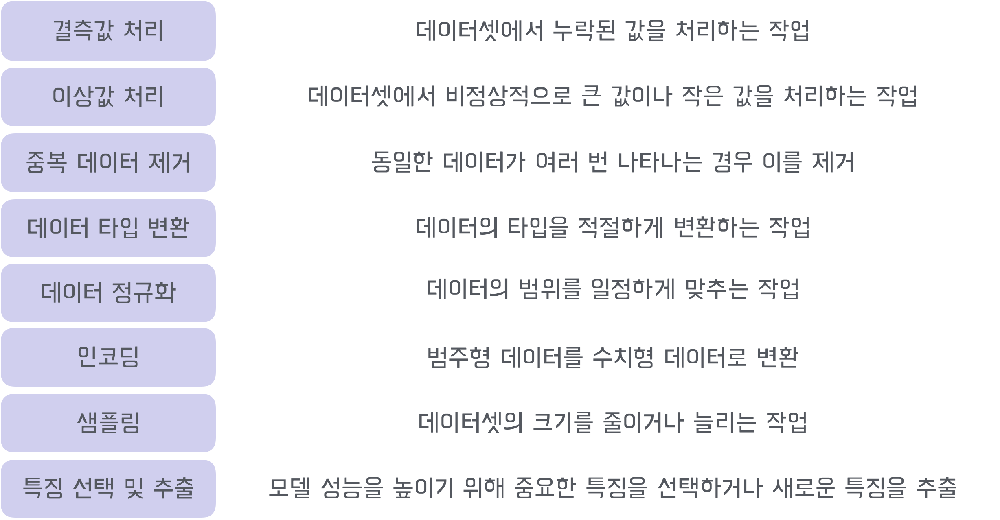

# 데이터 전처리


### 결측치 처리방법 (제거, 대체, 예측)

```py
# 결측값이 포함된 행 제거
df_dropped_rows = df.dropna()

# 결측값이 포함된 열 제거
df_dropped_cols = df.dropna(axis=1)
```

```py
# 결측값을 0으로 대체
df_filled = df.fillna(0)

# 결측값을 각 열의 평균값으로 대체
df_filled_mean = df.fillna(df.mean())

# 결측값을 각 열의 중간값으로 대체
df_filled_median = df.fillna(df.median())

# 결측값을 각 열의 최빈값으로 대체
df_filled_mode = df.fillna(df.mode().iloc[0])
```

```py
from sklearn.linear_model import LinearRegression

# 결측값이 있는 열과 없는 열 분리
df_with_na = df[df['column_with_na'].isnull()]
df_without_na = df[df['column_with_na'].notnull()]

# 회귀 모델 학습
model = LinearRegression()
model.fit(df_without_na[['feature1', 'feature2']], df_without_na['column_with_na'])

# 결측값 예측
predicted_values = model.predict(df_with_na[['feature1', 'feature2']])

# 예측된 값으로 결측값 대체
df.loc[df['column_with_na'].isnull(), 'column_with_na'] = predicted_values
```
---

### 이상치 처리(제거, 대체, 변환)
```py
# 특정 열의 이상치 확인 (IQR)
Q1 = df['column_name'].quantile(0.25)
Q3 = df['column_name'].quantile(0.75)
IQR = Q3 - Q1

# 이상치 범위 설정
lower_bound = Q1 - 1.5 * IQR
upper_bound = Q3 + 1.5 * IQR

# 이상치 확인
outliers = df[(df['column_name'] < lower_bound) | (df['column_name'] > upper_bound)]
print(outliers)
```

```py
# 이상치 제거
df_no_outliers = df[(df['column_name'] >= lower_bound) & (df['column_name'] <= upper_bound)]

# 이상치를 평균값으로 대체
mean_value = df['column_name'].mean()
df['column_name'] = df['column_name'].apply(lambda x: mean_value if x < lower_bound or x > upper_bound else x)
```
```py
# 중복된 행 확인
print(df.duplicated().sum())

# 중복된 행 제거 (drop_duplicates 내장함수 활용)
df_no_duplicates = df.drop_duplicates()

# name 컬럼만 중복 판별/제거
df.drop_duplicates(subset=['name'])

# 첫번째 중복행만 남기고 삭제
df.drop_duplicates(keep='first')

# 마지막 중복행만 남기고 삭제
df.drop_duplicates(keep='last')

# 중복행 모두 삭제
df.drop_duplicates(keep='False')
```
```py
# 특정 열의 데이터 타입을 정수형으로 변환
df['column_name'] = df['column_name'].astype(int)

# 특정 열의 데이터 타입을 문자열로 변환
df['column_name'] = df['column_name'].astype(str)

# 특정 열의 데이터 타입을 부동 소수점으로 변환
df['column_name'] = df['column_name'].astype(float)
```
---
### 인코딩 (Encoding)
```py
1. Label 인코딩
['apple', 'banana', 'cherry']라는 값을 [0, 1, 2]와 같이 각각의 카테고리에 숫자를 부여

data = ['apple', 'banana', 'cherry']
encoded_data = le.fit_transform(data)
# [0, 1, 2]
```

```py
2. One-Hot 인코딩
각 값에 대해 고유한 열을 생성하고, 해당 열에는 값이 존재할 때만 1을 넣고 나머지는 0으로 표시

data = pd.DataFrame({'fruit': ['apple', 'banana', 'cherry']})
one_hot_encoded_data = pd.get_dummies(data, columns=['fruit'])
print(one_hot_encoded_data)
#   fruit_apple  fruit_banana  fruit_cherry
# 0           1             0             0
# 1           0             1             0
# 2           0             0             1
```

```py
3. 순서 인코딩 (Ordinal Encoding)
data = pd.DataFrame({'education': ['고졸', '대졸', '석사', '박사']})
education_order = {'고졸': 0, '대졸': 1, '석사': 2, '박사': 3}
data['education_encoded'] = data['education'].map(education_order)
print(data)
```
<div>
<table border="1" class="dataframe">
  <thead>
    <tr style="text-align: right;">
      <th></th>
      <th>education</th>
      <th>education_encoded</th>
    </tr>
  </thead>
  <tbody>
    <tr>
      <th>0</th>
      <td>고졸</td>
      <td>0</td>
    </tr>
    <tr>
      <th>1</th>
      <td>대졸</td>
      <td>1</td>
    </tr>
    <tr>
      <th>2</th>
      <td>석사</td>
      <td>2</td>
    </tr>
    <tr>
      <th>3</th>
      <td>박사</td>
      <td>3</td>
    </tr>
  </tbody>
</table>
</div>

```py
4. Target 인코딩
각 범주가 가지는 목표 변수(타겟)와의 평균 관계를 수치형 값으로 대체하는 방법

data = pd.DataFrame({
    'city': ['Seoul', 'Busan', 'Seoul', 'Daegu', 'Busan', 'Seoul'],
    'price': [500, 300, 700, 200, 250, 800]
})

# city 별 price의 평균값을 계산하여 매핑
city_target_mean = data.groupby('city')['price'].mean()
data['city_encoded'] = data['city'].map(city_target_mean)

print(data)
------------------
     city  price  city_encoded
0   Seoul    500     666.666667
1   Busan    300     275.000000
2   Seoul    700     666.666667
3   Daegu    200     200.000000
4   Busan    250     275.000000
5   Seoul    800     666.666667
```

```py
5. 임베딩 (Embedding)
범주형 변수의 각 카테고리를 고정 크기의 벡터로 변환

import torch
import torch.nn as nn

# 예제 범주형 변수 (예: 도시의 인덱스)
city_idx = torch.tensor([0, 1, 0, 2, 1, 0])  # 예를 들어, 0=Seoul, 1=Busan, 2=Daegu

# 임베딩 레이어 설정 (카테고리 수는 3, 임베딩 차원은 4로 설정)
embedding_layer = nn.Embedding(num_embeddings=3, embedding_dim=4)

# 각 도시 인덱스에 대한 임베딩 벡터 가져오기
city_embeddings = embedding_layer(city_idx)

print(city_embeddings)
------------------
tensor([[ 0.1234, -0.5678,  0.2345, -0.6789],
        [ 0.3456, -0.7890,  0.4567, -0.8901],
        [ 0.1234, -0.5678,  0.2345, -0.6789],
        [ 0.7890, -0.3456,  0.5678, -0.1234],
        [ 0.3456, -0.7890,  0.4567, -0.8901],
        [ 0.1234, -0.5678,  0.2345, -0.6789]])

```
---
### 샘플링 (Sampling)
 - 데이터셋의 크기를 줄이거나 늘리는 과정

```py
# 데이터셋에서 50% 샘플 추출
df_sampled = df.sample(frac=0.5)

# 데이터셋에서 100개의 샘플 추출
df_sampled_n = df.sample(n=100)
```

### 특징 선택/추출 (feature selection/extraction)
```py
from sklearn.feature_selection import SelectKBest, f_classif

# 특징 선택 (상위 5개의 특징 선택)
selector = SelectKBest(score_func=f_classif, k=5)
X_new = selector.fit_transform(X, y)

# 선택된 특징의 인덱스
selected_features = selector.get_support(indices=True)
print(selected_features)
```